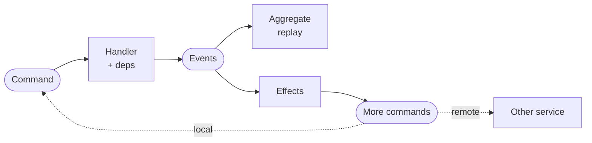
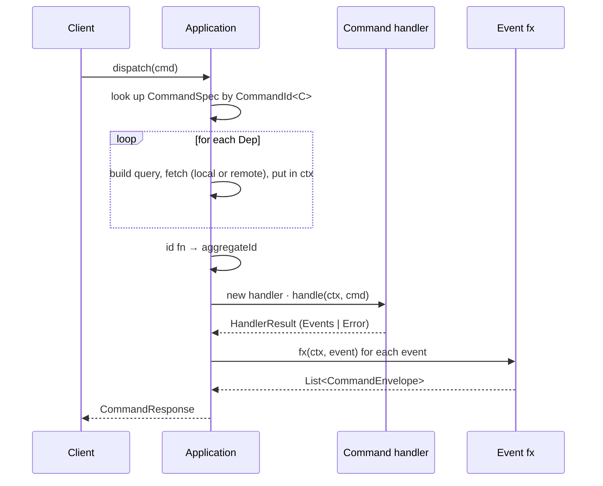
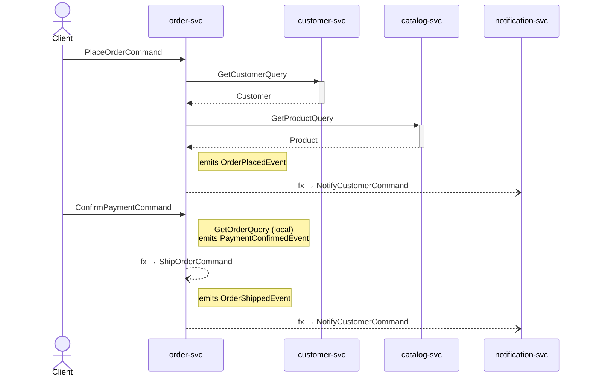
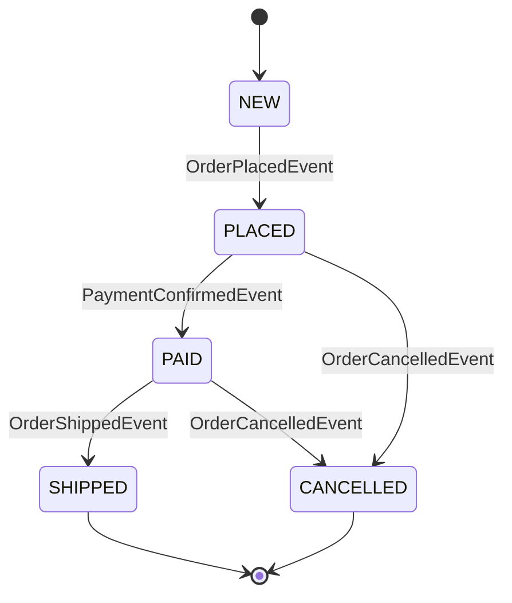

# edd-java

> Event-sourced CQRS for Java with end-to-end compile-time type safety.

A Java port of the Clojure [edd-core](https://github.com/alpha-prosoft/edd-core). Everything — commands, events, aggregates, queries, deps — is a record. Every registration is checked by `javac`.



> [!NOTE]
> **API proposal.** Dispatcher runs and is verified by 8 tests. Persistence, replay, schema validation, wire serialization not yet implemented — see [Status](#status).

---

# Getting started — build the Order service

Walk through every file you'd write for a minimal order-processing service: place an order (needs a customer and a product from remote services), confirm payment, ship, cancel. The full working example lives under `src/test/java/com/alphaprosoft/edd/order/`.

**Prerequisites:** Java 25 + Maven 3.9+.

## 1. Domain types

Plain Java records — no framework dependency. Currency helpers, statuses, customer/product:

```java
public record Money(long amountCents, String currency) {
    public static Money usd(long cents) { return new Money(cents, "USD"); }
    public Money times(int n)           { return new Money(amountCents * n, currency); }
}

public record Customer(UUID id, String name, Customer.Tier tier) {
    public enum Tier { STANDARD, GOLD, PLATINUM }
}

public record Product(UUID id, String name, Money price, int stock) {}

public enum OrderStatus { NEW, PLACED, PAID, SHIPPED, CANCELLED }
```

## 2. Events

Past-tense records. Group all events for one aggregate as a **sealed interface** so the apply switch is exhaustive:

```java
public sealed interface OrderEvent extends Event
        permits OrderPlacedEvent, PaymentConfirmedEvent, OrderCancelledEvent, OrderShippedEvent {}

public record OrderPlacedEvent(UUID id, UUID customerId, UUID productId, int quantity, Money total)
        implements OrderEvent {}
public record PaymentConfirmedEvent(UUID id, Money amount)        implements OrderEvent {}
public record OrderCancelledEvent(UUID id, String reason)         implements OrderEvent {}
public record OrderShippedEvent(UUID id, String trackingNumber)   implements OrderEvent {}
```

## 3. The Aggregate

Folded state. The apply switch is exhaustive — no `default`, no `instanceof`, no `throw new IllegalArgumentException` for unknown events:

```java
public record OrderAggregate(
        UUID id, long version, OrderStatus status,
        UUID customerId, UUID productId, int quantity, Money total, String trackingNumber)
        implements Aggregate {

    public static OrderAggregate initial(UUID id) {
        return new OrderAggregate(id, 0, OrderStatus.NEW, null, null, 0, null, null);
    }

    public OrderAggregate applyEvent(OrderEvent event) {
        return switch (event) {
            case OrderPlacedEvent e        -> new OrderAggregate(
                    e.id(), version + 1, OrderStatus.PLACED,
                    e.customerId(), e.productId(), e.quantity(), e.total(), null);
            case PaymentConfirmedEvent _   -> new OrderAggregate(
                    id, version + 1, OrderStatus.PAID, customerId, productId, quantity, total, trackingNumber);
            case OrderCancelledEvent _     -> new OrderAggregate(
                    id, version + 1, OrderStatus.CANCELLED, customerId, productId, quantity, total, trackingNumber);
            case OrderShippedEvent e       -> new OrderAggregate(
                    id, version + 1, OrderStatus.SHIPPED, customerId, productId, quantity, total, e.trackingNumber());
        };
    }
}
```

## 4. Commands

Imperative verb + `Command` suffix:

```java
public record PlaceOrderCommand(UUID id, UUID customerId, UUID productId, int quantity) implements Command {}
public record ConfirmPaymentCommand(UUID id, UUID orderId, Money amount)                 implements Command {}
public record CancelOrderCommand(UUID id, UUID orderId, String reason)                   implements Command {}
public record ShipOrderCommand(UUID id, UUID orderId, String trackingNumber)             implements Command {}
public record NotifyCustomerCommand(UUID id, UUID customerId, String message)            implements Command {}
```

## 5. Queries

Plain records:

```java
public record GetOrderQuery(UUID id)    implements Query {}
public record GetCustomerQuery(UUID id) implements Query {}
public record GetProductQuery(UUID id)  implements Query {}
```

## 6. Typed IDs

Each command/event/query gets a **typed singleton** ID. Java's `enum` can't carry a generic, so these are the typesafe-enum pattern. Stick them all in one place:

```java
public final class OrderIds {

    public static final CommandId<PlaceOrderCommand>    PLACE_ORDER     = CommandId.of("place-order",     PlaceOrderCommand.class);
    public static final CommandId<ConfirmPaymentCommand> CONFIRM_PAYMENT = CommandId.of("confirm-payment", ConfirmPaymentCommand.class);
    public static final CommandId<CancelOrderCommand>   CANCEL_ORDER    = CommandId.of("cancel-order",    CancelOrderCommand.class);
    public static final CommandId<ShipOrderCommand>     SHIP_ORDER      = CommandId.of("ship-order",      ShipOrderCommand.class);

    public static final EventId<OrderPlacedEvent>       ORDER_PLACED      = EventId.of("order-placed",      OrderPlacedEvent.class);
    public static final EventId<PaymentConfirmedEvent>  PAYMENT_CONFIRMED = EventId.of("payment-confirmed", PaymentConfirmedEvent.class);
    public static final EventId<OrderCancelledEvent>    ORDER_CANCELLED   = EventId.of("order-cancelled",   OrderCancelledEvent.class);
    public static final EventId<OrderShippedEvent>      ORDER_SHIPPED     = EventId.of("order-shipped",     OrderShippedEvent.class);

    public static final QueryId<GetOrderQuery,    OrderAggregate> GET_ORDER    = QueryId.of("get-order",    GetOrderQuery.class,    OrderAggregate.class);
    public static final QueryId<GetCustomerQuery, Customer>       GET_CUSTOMER = QueryId.of("get-customer", GetCustomerQuery.class, Customer.class);
    public static final QueryId<GetProductQuery,  Product>        GET_PRODUCT  = QueryId.of("get-product",  GetProductQuery.class,  Product.class);
}
```

`QueryId<Q, R>` carries the response type too, so anything using `GET_CUSTOMER` knows it produces a `Customer`.

## 7. Remote services

Names for other services this one talks to:

```java
public final class Services {
    public static final Service CUSTOMER_SVC     = Service.of("customer-svc");
    public static final Service CATALOG_SVC      = Service.of("catalog-svc");
    public static final Service NOTIFICATION_SVC = Service.of("notification-svc");
}
```

## 8. Deps — typed keys for the resolved context

A `Dep<Q, T>` says: *fetch a `T` by sending a `Q` query*. `Dep.local(...)` for queries this service answers, `Dep.remote(...)` for cross-service:

```java
public final class OrderDeps {

    public static final Dep<GetCustomerQuery, Customer> CUSTOMER =
        Dep.remote("customer", Services.CUSTOMER_SVC, OrderIds.GET_CUSTOMER);

    public static final Dep<GetProductQuery, Product> PRODUCT =
        Dep.remote("product", Services.CATALOG_SVC, OrderIds.GET_PRODUCT);

    public static final Dep<GetOrderQuery, OrderAggregate> CURRENT_ORDER =
        Dep.local("order", OrderIds.GET_ORDER);
}
```

No query lambda here — that's bound per-command at registration.

## 9. Command handlers

One class per command. Public no-arg constructor; the framework creates a fresh instance for every dispatch. Read deps via `ctx.getDeps(KEY)`:

```java
public final class PlaceOrderHandler implements CommandHandler<PlaceOrderCommand, OrderAggregate> {
    @Override
    public HandlerResult<OrderAggregate> handle(Context ctx, PlaceOrderCommand cmd) {
        Customer customer = ctx.getDeps(OrderDeps.CUSTOMER);   // typed: Customer
        Product  product  = ctx.getDeps(OrderDeps.PRODUCT);    // typed: Product

        if (product.stock() < cmd.quantity()) {
            return HandlerResult.error("insufficient-stock");
        }
        Money total = product.price().times(cmd.quantity());
        return HandlerResult.of(new OrderPlacedEvent(
                cmd.id(), customer.id(), product.id(), cmd.quantity(), total));
    }
}
```

The other handlers (`ConfirmPaymentHandler`, `CancelOrderHandler`, `ShipOrderHandler`) follow the same shape — read the current order from `ctx.getDeps(OrderDeps.CURRENT_ORDER)`, validate, emit an event.

`HandlerResult.of(event)` succeeds with one (or more) events; `HandlerResult.error("code")` fails.

## 10. Effects — follow-up commands

`EventFxHandler<E>` runs after an event is emitted and returns commands to dispatch next:

```java
public final class OrderPlacedEffect implements EventFxHandler<OrderPlacedEvent> {
    @Override
    public List<CommandEnvelope<?>> fx(Context ctx, OrderPlacedEvent event) {
        return List.of(CommandEnvelope.on(
            Services.NOTIFICATION_SVC,
            new NotifyCustomerCommand(UUID.randomUUID(), event.customerId(),
                                      "Order placed: " + event.id())));
    }
}

public final class PaymentConfirmedEffect implements EventFxHandler<PaymentConfirmedEvent> {
    @Override
    public List<CommandEnvelope<?>> fx(Context ctx, PaymentConfirmedEvent event) {
        return List.of(CommandEnvelope.local(
            new ShipOrderCommand(UUID.randomUUID(), event.id(), "TRACK-" + event.id())));
    }
}
```

- `CommandEnvelope.local(cmd)` chains within this service.
- `CommandEnvelope.on(svc, cmd)` targets a remote service.

## 11. The module — wire it all together

The module pins the aggregate type once, then registers every command, event, and effect:

```java
public final class OrderModule {

    public static Module<OrderAggregate> register(Module<OrderAggregate> m) {
        return m

            .regCmd(OrderIds.PLACE_ORDER, spec -> spec
                    .handler(PlaceOrderHandler.class)
                    .dep(OrderDeps.CUSTOMER, (_, cmd) -> new GetCustomerQuery(cmd.customerId()))
                    .dep(OrderDeps.PRODUCT,  (_, cmd) -> new GetProductQuery(cmd.productId()))
                    .build())

            .regCmd(OrderIds.CONFIRM_PAYMENT, spec -> spec
                    .handler(ConfirmPaymentHandler.class)
                    .dep(OrderDeps.CURRENT_ORDER, (_, cmd) -> new GetOrderQuery(cmd.orderId()))
                    .id((_, cmd) -> cmd.orderId())                // aggregate id ≠ cmd id
                    .build())

            .regCmd(OrderIds.CANCEL_ORDER, spec -> spec
                    .handler(CancelOrderHandler.class)
                    .dep(OrderDeps.CURRENT_ORDER, (_, cmd) -> new GetOrderQuery(cmd.orderId()))
                    .id((_, cmd) -> cmd.orderId())
                    .build())

            .regCmd(OrderIds.SHIP_ORDER, spec -> spec
                    .handler(ShipOrderHandler.class)
                    .dep(OrderDeps.CURRENT_ORDER, (_, cmd) -> new GetOrderQuery(cmd.orderId()))
                    .id((_, cmd) -> cmd.orderId())
                    .build())

            .regEvent(OrderIds.ORDER_PLACED,      OrderModule::apply)
            .regEvent(OrderIds.PAYMENT_CONFIRMED, OrderModule::apply)
            .regEvent(OrderIds.ORDER_CANCELLED,   OrderModule::apply)
            .regEvent(OrderIds.ORDER_SHIPPED,     OrderModule::apply)

            .regEventFx(OrderIds.ORDER_PLACED,      new OrderPlacedEffect())
            .regEventFx(OrderIds.PAYMENT_CONFIRMED, new PaymentConfirmedEffect())
            .regEventFx(OrderIds.ORDER_SHIPPED,     new OrderShippedEffect());
    }

    private static OrderAggregate apply(OrderAggregate agg, OrderEvent event) {
        OrderAggregate base = agg == null ? OrderAggregate.initial(event.id()) : agg;
        return base.applyEvent(event);
    }
}
```

Things to notice:

- `.handler(PlaceOrderHandler.class)` — pass the class, not an instance. After this line the builder *knows* `C = PlaceOrderCommand`, so the `.dep(...)` lambdas type `cmd` automatically — no type witness needed.
- `.dep(KEY, fn)` — `KEY`'s `Q` constrains the lambda's return type; `KEY`'s `T` is what `ctx.getDeps(KEY)` will return.
- `.id((_, cmd) -> cmd.orderId())` — when the **command id** differs from the **aggregate id** (here: `ConfirmPaymentCommand.id` is the payment's own id; `cmd.orderId()` is the order being paid for). Default: aggregate id = `cmd.id()`.

## 12. Wire up the Application

```java
QueryHandler<GetOrderQuery, OrderAggregate> getOrder = (ctx, q) -> orderStore.findById(q.id());

RemoteResolver remote = (service, query) -> httpClient.callService(service, query);

Application app = Application.builder("order-svc")
    .module(OrderAggregate.class, OrderModule::register)
    .regQuery(OrderIds.GET_ORDER, getOrder)
    .remoteResolver(remote)
    .build();
```

`.build()` validates that every local `Dep` has a registered query handler — fail-fast on misconfiguration.

## 13. Dispatch

```java
CommandResponse resp = app.dispatch(
    new PlaceOrderCommand(UUID.randomUUID(), customerId, productId, 3),
    RequestMeta.newRequest());

switch (resp) {
    case CommandResponse.Success(UUID aggregateId, var events, var effects) -> {
        // events  — what happened, persist to event store
        // effects — follow-up commands to dispatch (local or to other services)
        // aggregateId — id this dispatch is about
    }
    case CommandResponse.Failure(String code, var details) -> {
        // handle error
    }
}
```

That's the whole flow. Pattern matching with record deconstruction (Java 21+) gives you typed access to every field in one line.

---

# How a dispatch flows



Cross-service:



Order aggregate state machine:



---

# Concept reference

| Concept | Naming | Implementation |
|---|---|---|
| **Command** | `PlaceOrderCommand` | `record … implements Command` |
| **Event** | `OrderPlacedEvent` | `record … implements Event` (sealed parent per aggregate) |
| **Aggregate** | `OrderAggregate` | `record … implements Aggregate` |
| **Query** | `GetOrderQuery` | `record … implements Query` |
| **Handler** | `PlaceOrderHandler` | `class … implements CommandHandler<C, A>`, public no-arg ctor, new instance per dispatch |
| **Effect** | `OrderPlacedEffect` | `class … implements EventFxHandler<E>` |
| **CommandId** | `PLACE_ORDER` | `CommandId<C>` typed singleton |
| **EventId** | `ORDER_PLACED` | `EventId<E>` typed singleton |
| **QueryId** | `GET_ORDER` | `QueryId<Q, R>` typed singleton (response type included) |
| **Dep** | `CUSTOMER` | `Dep<Q, T>` typed key (name + QueryId + optional Service) |

---

# Java 25 features used

| Feature | Where |
|---|---|
| Records | every `Command`, `Event`, `Aggregate`, `Query`, plus framework types |
| Sealed interfaces | `OrderEvent`, `HandlerResult`, `CommandResponse`, `CommandSpec.Init`/`Builder` |
| Pattern matching for switch | `OrderAggregate.applyEvent`, `Application.dispatchTyped`, `CancelOrderHandler` |
| Record deconstruction in `case` | `case Events<A>(List<Event> es) -> …` |
| Unnamed `_` | every dep/id lambda `(_, cmd) -> …` |
| Unnamed pattern `case T _` | aggregate apply when fields aren't read |
| Exhaustive switch on sealed | aggregate apply (no `default`) |
| `ClassValue` | per-handler-class constructor cache |

---

# Mapping to edd-core (Clojure)

| edd-core | edd-java |
|---|---|
| `(edd/reg-cmd :create-user handler :deps {…} :id-fn …)` | `m.regCmd(CREATE_USER, spec -> spec.handler(H.class).dep(KEY, fn).id(…).build())` |
| `(edd/reg-event :user-created (fn [agg evt] …))` | `m.regEvent(USER_CREATED, (agg, evt) -> …)` |
| `(edd/reg-event-fx :user-created (fn [ctx evt] …))` | `m.regEventFx(USER_CREATED, new UserCreatedEffect())` |
| `(edd/reg-query :get-user handler)` | `m.regQuery(GET_USER, handler)` |
| `(comp moduleA/register moduleB/register)` | `.module(A.class, A::register).module(B.class, B::register)` |
| Keyword `:create-user` | `CommandId<CreateUserCommand> CREATE_USER` |
| `(:user ctx)` from `:deps [:user …]` | `ctx.getDeps(USER_DEP)` |

---

# Status

### Done

- [x] Typed `CommandId<C>`, `EventId<E>`, `QueryId<Q, R>`, `Dep<Q, T>` registries
- [x] Staged `CommandSpec.builder` (handler required first)
- [x] Handlers registered by `Class`, instantiated fresh per dispatch (cached constructor)
- [x] `.dep(KEY, fn)` chained on builder — no type witness needed
- [x] `ctx.getDeps(KEY)` one-call typed dep lookup
- [x] `Module<A>` — aggregate type pinned once
- [x] Sealed `HandlerResult` and `CommandResponse`
- [x] `regEventFx` + `CommandEnvelope` for cross-service effects
- [x] `RemoteResolver` seam for remote query resolution
- [x] Build-time validation: missing local query handler ⇒ `Application.build()` fails

### Not yet

- [ ] Aggregate replay from event store
- [ ] Postgres event store / OpenSearch view store
- [ ] Wire serialization (Jackson, edd-core-compatible)
- [ ] Schema validation
- [ ] Recursive fx dispatch
- [ ] Optimistic concurrency control
- [ ] AWS Lambda runtime
- [ ] Test fixture analogue of `edd.test.fixture.dal`

---

# Build

Java 25 + Maven 3.9+. With direnv, `.envrc` puts Corretto 25 on `PATH`.

```bash
mvn verify            # compile, test, Spotless check
mvn spotless:apply    # auto-format
```

Tooling: JUnit 5, Spotless (`palantir-java-format` 2.90.0).

---

# Credits

Designed after Robert Pofuk's [edd-core](https://github.com/alpha-prosoft/edd-core) (Clojure). All concepts come from there. The Java type-system choices — typed-enum IDs, sealed events, `Dep<Q, T>` heterogeneous map keys, `Module<A>`, staged builder, per-dispatch handler instantiation — are what make a port worthwhile in a language without runtime data-driven dispatch.
