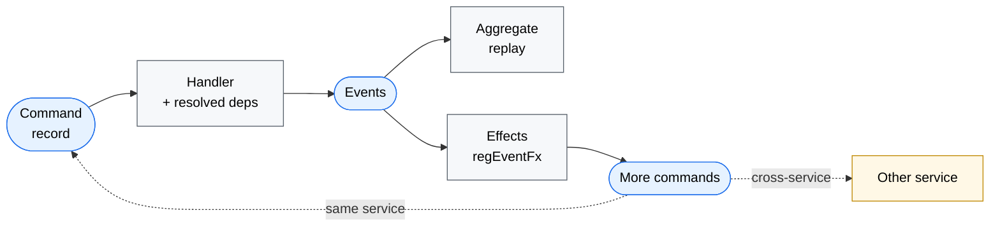
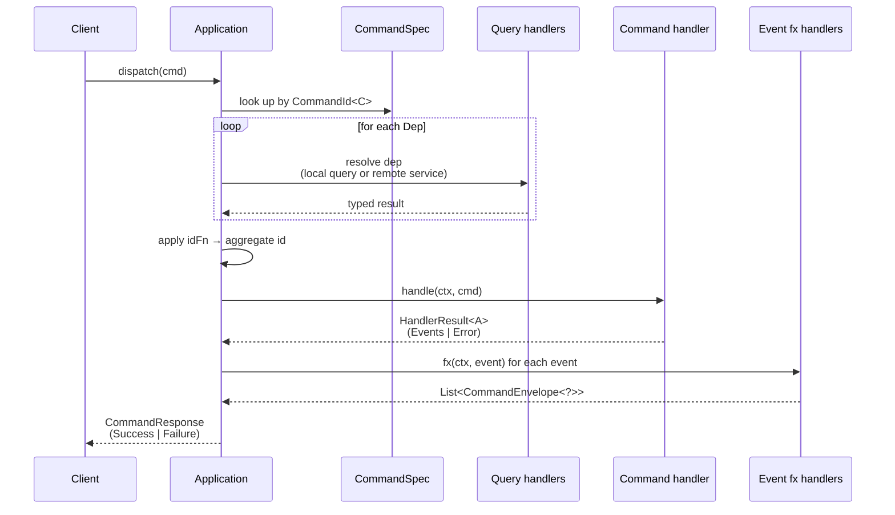
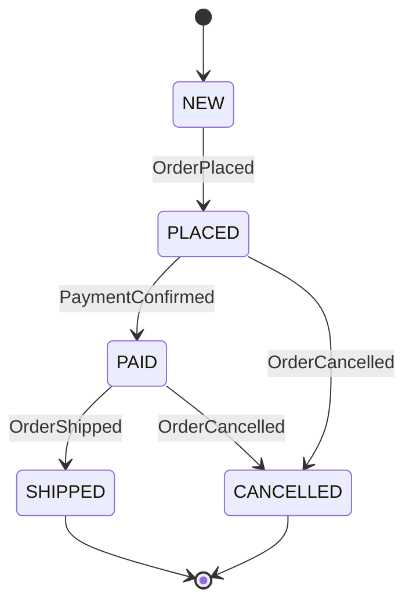
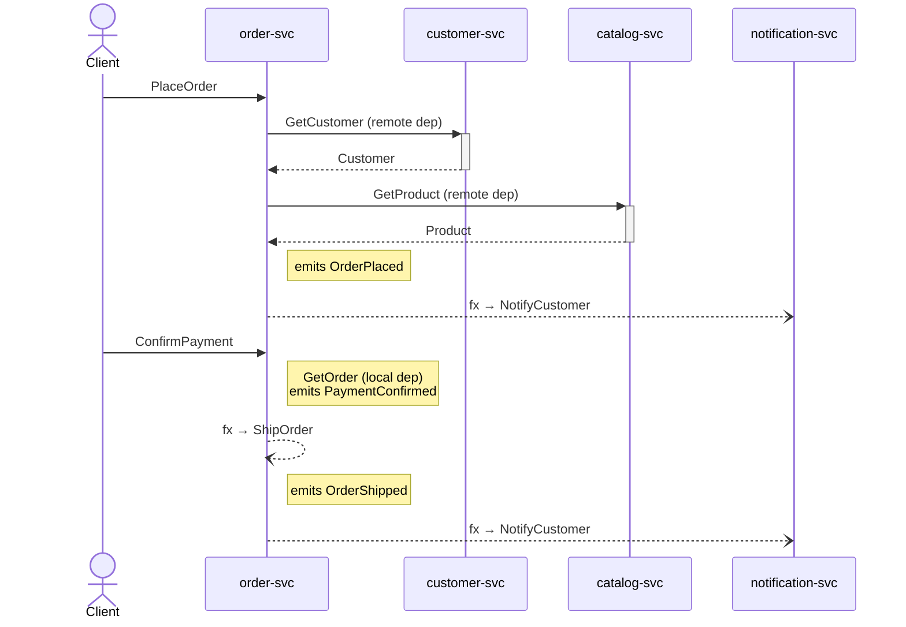

# edd-java

> Event-sourced CQRS for Java, with end-to-end compile-time type safety.

A Java port of the [edd-core](https://github.com/alpha-prosoft/edd-core) Clojure library. Where edd-core leans on Clojure's runtime data dispatch, edd-java pushes those guarantees into the type system: every command, event, aggregate, query, and dependency is a record, and the registration of each is checked by the compiler.



> [!NOTE]
> This is an **API proposal**. The dispatch pipeline runs end-to-end and is statically verified by 8 tests, but persistence, snapshotting, schema validation, and wire serialization are not yet implemented. See [Status](#status).

---

## Why typed IDs?

The whole library hinges on one idea: **the registration key for a command is a typed singleton, not a string**.

```java
public static final CommandId<PlaceOrder> PLACE_ORDER =
    CommandId.of("place-order", PlaceOrder.class);
```

`PLACE_ORDER` is a `CommandId<PlaceOrder>` — its type parameter knows which record this id is for. Every other piece of the framework inherits that knowledge:

```java
app.regCmd(CommandSpec.builder(OrderIds.PLACE_ORDER, OrderAggregate.class)
    .handler(new UpdateOrderHandler())   // ❌ compile error: not CommandHandler<PlaceOrder, ?>
    .build());
```

A real `enum` can't be generic, so `CommandId<C>` is built with the classic typesafe-enum pattern: a final class with static constants. Same call site, real generics.

The same trick is applied to `EventId<E>`, `QueryId<Q, R>` (response type is part of the key), and `Dep<Q, T>` (heterogeneous map keys, where `Q` ties to a `QueryId` and `T` is the result type stored in the context).

---

## Concepts

### Five building blocks

| | What it is | Naming | Implementation |
|---|---|---|---|
| **Command** | A request to do something | Imperative: `PlaceOrder` | `record … implements Command` |
| **Event** | A fact that happened | Past tense: `OrderPlaced` | `record … implements Event` |
| **Aggregate** | Folded state of one entity | Noun: `OrderAggregate` | `record … implements Aggregate` |
| **Query** | A read request | `Get*`, `List*`, `Find*` | `record … implements Query` |
| **Effect** | Follow-up commands after events | `<Event>Effect` | `class … implements EventFxHandler<E>` |

### Command lifecycle



### Heterogeneous, typed `Context`

The context flowing through handlers is a heterogeneous map keyed by `Dep<?, T>` — Joshua Bloch's [type-safe heterogeneous container](https://docs.oracle.com/javase/specs/jls/se21/html/jls-4.html#:~:text=heterogeneous), but with the key's `T` baked into the lookup:

```java
public interface Context {
    <T> T get(Dep<?, T> key);   // <T> flows from the Dep, no cast in user code
}
```

```java
Customer customer = ctx.get(OrderDeps.CUSTOMER);   // returns Customer
Product   product = ctx.get(OrderDeps.PRODUCT);    // returns Product
```

---

## The Order example

A realistic — if simplified — order processing service that exercises every concept end-to-end. Lives in `src/test/java/com/alphaprosoft/edd/order/`.

### Package layout

```
order/
├── command/        # records that drive writes + their handlers
│   ├── PlaceOrder.java             ─┐
│   ├── PlaceOrderHandler.java      ─┘ command + handler co-located
│   ├── ConfirmPayment.java         ─┐
│   ├── ConfirmPaymentHandler.java  ─┘
│   ├── CancelOrder.java
│   ├── CancelOrderHandler.java
│   ├── ShipOrder.java
│   ├── ShipOrderHandler.java
│   └── NotifyCustomer.java         (foreign cmd targeted by an effect)
│
├── event/          # sealed event hierarchy
│   ├── OrderEvent.java             (sealed interface)
│   ├── OrderPlaced.java
│   ├── PaymentConfirmed.java
│   ├── OrderCancelled.java
│   └── OrderShipped.java
│
├── query/          # read requests
│   ├── GetOrder.java               (local — answered by this service)
│   ├── GetCustomer.java            (remote — answered by customer-svc)
│   └── GetProduct.java             (remote — answered by catalog-svc)
│
├── effect/         # one class per event → side-effect mapping
│   ├── OrderPlacedEffect.java      (→ notification)
│   ├── PaymentConfirmedEffect.java (→ chain ShipOrder locally)
│   └── OrderShippedEffect.java     (→ notification)
│
├── Customer.java   Product.java   Money.java   OrderStatus.java
├── OrderAggregate.java
├── OrderIds.java   OrderDeps.java   Services.java
└── OrderModule.java                (the .register(builder) entry point)
```

### Commands as plain records

Each command is a record implementing `Command`. No marker interfaces, no inheritance hierarchy — the type system tracks each command independently.

```java
public record PlaceOrder(UUID id, UUID customerId, UUID productId, int quantity) implements Command {}
public record ConfirmPayment(UUID id, UUID orderId, Money amount)                  implements Command {}
public record CancelOrder(UUID id, UUID orderId, String reason)                    implements Command {}
public record ShipOrder(UUID id, UUID orderId, String trackingNumber)              implements Command {}
```

### Events form a sealed hierarchy

```java
public sealed interface OrderEvent extends Event
        permits OrderPlaced, PaymentConfirmed, OrderCancelled, OrderShipped {}
```

This is the second key win for the type system: the aggregate's `applyEvent` becomes a `switch` with **no `default`** — adding a new event variant turns into a compile error everywhere it needs to be handled.

```java
public OrderAggregate applyEvent(OrderEvent event) {
    return switch (event) {
        case OrderPlaced e        -> new OrderAggregate(e.id(), version + 1, OrderStatus.PLACED, …);
        case PaymentConfirmed _   -> new OrderAggregate(id, version + 1, OrderStatus.PAID,    …);
        case OrderCancelled _     -> new OrderAggregate(id, version + 1, OrderStatus.CANCELLED, …);
        case OrderShipped e       -> new OrderAggregate(id, version + 1, OrderStatus.SHIPPED, …, e.trackingNumber());
        // no default needed — sealed type, exhaustive switch
    };
}
```

`case PaymentConfirmed _` uses unnamed patterns (Java 22+) when the variant's fields aren't needed.

The aggregate's state machine — implicit in the `switch` above — is:



### Dependencies are split into **keys** and **wiring**

A `Dep<Q, T>` is *just a typed key* — a name, a `QueryId`, and (for remote deps) which service to call. No query lambda baked in:

```java
public final class OrderDeps {

    public static final Dep<GetCustomer, Customer> CUSTOMER =
        Dep.remote("customer", Services.CUSTOMER_SVC, OrderIds.GET_CUSTOMER);

    public static final Dep<GetProduct, Product> PRODUCT =
        Dep.remote("product", Services.CATALOG_SVC, OrderIds.GET_PRODUCT);

    public static final Dep<GetOrder, OrderAggregate> CURRENT_ORDER =
        Dep.local("order", OrderIds.GET_ORDER);
}
```

The `<Q, T>` type parameters say: this dep produces a query of type `Q` and yields a value of type `T` (read off the `QueryId<Q, T>`).

The **how-to-build-the-query** part is provided at registration time, alongside the command:

```java
.deps(Deps.<PlaceOrder>builder()
        .reg(OrderDeps.CUSTOMER, (_, cmd) -> new GetCustomer(cmd.customerId()))
        .reg(OrderDeps.PRODUCT,  (_, cmd) -> new GetProduct(cmd.productId()))
        .build())
```

Three guarantees fall out of this split:

1. **The lambda is locked to the command type.** `Deps.<PlaceOrder>builder()` parameterises the builder by `PlaceOrder`, so the lambda sees `cmd` as a `PlaceOrder` and can call its record components directly. No marker interfaces needed — the call-site type witness does the work.
2. **The query produced is type-checked against the dep's `Q`.** `OrderDeps.CUSTOMER` is `Dep<GetCustomer, Customer>`, so `.reg(CUSTOMER, fn)` only accepts a lambda returning `GetCustomer`.
3. **The result stored in `ctx` carries `T`.** `ctx.get(OrderDeps.CUSTOMER)` returns `Customer` with no cast.

Reusing the same dep across commands with different shapes is just a different lambda:

```java
// PlaceOrder has a customerId field directly
.reg(OrderDeps.CUSTOMER, (_, cmd) -> new GetCustomer(cmd.customerId()))

// SendInvoice has a billingCustomerId field
.reg(OrderDeps.CUSTOMER, (_, cmd) -> new GetCustomer(cmd.billingCustomerId()))
```

### Handlers are tiny, typed classes

```java
public final class PlaceOrderHandler implements CommandHandler<PlaceOrder, OrderAggregate> {
    @Override
    public HandlerResult<OrderAggregate> handle(Context ctx, PlaceOrder cmd) {
        Customer customer = ctx.get(OrderDeps.CUSTOMER);   // typed!
        Product  product  = ctx.get(OrderDeps.PRODUCT);    // typed!

        if (product.stock() < cmd.quantity()) {
            return HandlerResult.error("insufficient-stock");
        }

        Money total = product.price().times(cmd.quantity());
        return HandlerResult.of(new OrderPlaced(cmd.id(), customer.id(), product.id(), cmd.quantity(), total));
    }
}
```

### Effects produce more commands

```java
public final class PaymentConfirmedEffect implements EventFxHandler<PaymentConfirmed> {
    @Override
    public List<CommandEnvelope<?>> fx(Context ctx, PaymentConfirmed event) {
        return List.of(CommandEnvelope.local(
            new ShipOrder(UUID.randomUUID(), event.id(), "TRACK-" + event.id())));
    }
}

public final class OrderPlacedEffect implements EventFxHandler<OrderPlaced> {
    @Override
    public List<CommandEnvelope<?>> fx(Context ctx, OrderPlaced event) {
        return List.of(CommandEnvelope.on(
            Services.NOTIFICATION_SVC,
            new NotifyCustomer(UUID.randomUUID(), event.customerId(), "Order placed: " + event.id())));
    }
}
```

`CommandEnvelope.local(cmd)` chains within this service; `CommandEnvelope.on(svc, cmd)` targets a remote service. Both flow through `Application.dispatch` later — the framework reads them off `CommandResponse.Success.effects()`.

The full set of flows for an order, including remote deps and effect fan-out:



### Wiring it all up: `OrderModule`

```java
public final class OrderModule {

    public static Application.Builder register(Application.Builder app) {
        return app
            .regCmd(CommandSpec.builder(OrderIds.PLACE_ORDER, OrderAggregate.class)
                    .handler(new PlaceOrderHandler())
                    .deps(Deps.<PlaceOrder>builder()
                            .reg(OrderDeps.CUSTOMER, (_, cmd) -> new GetCustomer(cmd.customerId()))
                            .reg(OrderDeps.PRODUCT,  (_, cmd) -> new GetProduct(cmd.productId()))
                            .build())
                    .build())
            .regCmd(CommandSpec.builder(OrderIds.CONFIRM_PAYMENT, OrderAggregate.class)
                    .handler(new ConfirmPaymentHandler())
                    .deps(Deps.<ConfirmPayment>builder()
                            .reg(OrderDeps.CURRENT_ORDER, (_, cmd) -> new GetOrder(cmd.orderId()))
                            .build())
                    .idFn((_, cmd) -> cmd.orderId())            // command id ≠ aggregate id
                    .build())
            .regCmd(/* CancelOrder */)
            .regCmd(/* ShipOrder */)
            .regEvent(OrderIds.ORDER_PLACED,       OrderAggregate.class, OrderModule::apply)
            .regEvent(OrderIds.PAYMENT_CONFIRMED,  OrderAggregate.class, OrderModule::apply)
            .regEvent(OrderIds.ORDER_CANCELLED,    OrderAggregate.class, OrderModule::apply)
            .regEvent(OrderIds.ORDER_SHIPPED,      OrderAggregate.class, OrderModule::apply)
            .regEventFx(OrderIds.ORDER_PLACED,      new OrderPlacedEffect())
            .regEventFx(OrderIds.PAYMENT_CONFIRMED, new PaymentConfirmedEffect())
            .regEventFx(OrderIds.ORDER_SHIPPED,     new OrderShippedEffect());
    }
}
```

### Tests show typing in action

```java
@Test
void confirmPaymentUsesIdFnAndProducesShipFx() {
    UUID orderId = UUID.randomUUID();
    OrderAggregate placed = new OrderAggregate(
        orderId, 1, OrderStatus.PLACED, …, Money.usd(2000), null);

    Application app = build(
        /* GetOrder local handler returns the placed order */ (_, _) -> placed,
        /* no remote calls expected           */              (_, _) -> { throw new IllegalStateException(); });

    CommandResponse resp = app.dispatch(
        new ConfirmPayment(UUID.randomUUID(), orderId, Money.usd(2000)),
        RequestMeta.newRequest());

    var success   = assertInstanceOf(CommandResponse.Success.class, resp);
    var confirmed = assertInstanceOf(PaymentConfirmed.class, success.events().get(0));
    assertEquals(orderId, confirmed.id());

    var fx   = success.effects().getFirst();
    var ship = assertInstanceOf(ShipOrder.class, fx.command());     // typed!
    assertEquals(orderId, ship.orderId());
}
```

---

## Java 25 features used

| Feature | Where in the code |
|---|---|
| Records | every `Command`, `Event`, `Aggregate`, `Query`, domain type |
| Sealed interfaces | `OrderEvent`, `HandlerResult`, `CommandResponse` |
| Pattern matching for switch | `Application.dispatchTyped`, `OrderAggregate.applyEvent`, `CancelOrderHandler` |
| Unnamed variable `_` | every dep lambda (`(_, cmd) -> …`), unused test stubs (`(_, _) -> …`) |
| Unnamed pattern `case T _` | `OrderAggregate.applyEvent` for events whose fields aren't read |
| Exhaustive `switch` on sealed types | aggregate apply (no `default` needed) |

---

## Mapping to edd-core (Clojure)

| edd-core | edd-java |
|---|---|
| `(edd/reg-cmd ctx :create-user handler :deps {…} :id-fn …)` | `app.regCmd(CommandSpec.builder(CREATE_USER, …).handler(…).deps(Deps.<…>builder().reg(…).build()).idFn(…).build())` |
| `(edd/reg-event ctx :user-created (fn [agg evt] …))` | `app.regEvent(USER_CREATED, UserAggregate.class, (agg, evt) -> …)` |
| `(edd/reg-event-fx ctx :user-created (fn [ctx evt] …))` | `app.regEventFx(USER_CREATED, new UserCreatedEffect())` |
| `(edd/reg-query ctx :get-user handler)` | `app.regQuery(GET_USER, handler)` |
| Map `{:cmd-id :create-user :id … :attrs {…}}` | `record CreateUser(UUID id, …) implements Command` |
| Keyword `:create-user` | `CommandId<CreateUser> CREATE_USER` |
| `(:user ctx)` after `:deps [:user dep-fn]` | `ctx.get(USER_DEP)` returning typed `User` |
| Malli schema `[:map [:cmd-id [:= :…]]]` | The record's component types |

The biggest semantic shift: edd-core dispatches on the `:cmd-id` keyword inside a map; edd-java dispatches on the record's class. The wire format remains compatible (the `cmd-id` string from `CommandId.id()` discriminates JSON payloads — when serialization is added).

---

## Status

### Done

- [x] Typed `CommandId<C>`, `EventId<E>`, `QueryId<Q, R>` registries
- [x] `Dep<Q, T>` typed keys with `Dep.local(...)` and `Dep.remote(...)` factories
- [x] `Deps.<C>builder().reg(KEY, fn).build()` wiring at registration time
- [x] `Context.get(Dep)` heterogeneous typed lookup
- [x] `CommandSpec<C, A>` builder with handler / deps / `idFn`
- [x] Sealed `HandlerResult` (`Events` | `Error`) and `CommandResponse` (`Success` | `Failure`)
- [x] `regEventFx` + `CommandEnvelope` for cross-service effects
- [x] `RemoteResolver` seam for remote query resolution
- [x] Build-time validation: missing local query handler ⇒ `Application.build()` fails

### Not yet

- [ ] Aggregate replay from event store (snapshots + events)
- [ ] Postgres event store
- [ ] OpenSearch / Postgres view store
- [ ] Wire serialization (Jackson, format-compatible with edd-core)
- [ ] Schema validation (probably JSR-380 or a record-component walker)
- [ ] Recursive fx dispatch (currently fx are returned in the response, not chained)
- [ ] Optimistic concurrency control (`event-seq`)
- [ ] AWS Lambda runtime integration
- [ ] Test fixture analogue of `edd.test.fixture.dal`

---

## Build and run

Requires **Java 25** (latest LTS) and **Maven 3.9+**. With [direnv](https://direnv.net/) the `.envrc` puts Corretto 25 on `PATH`; otherwise set `JAVA_HOME` manually.

```bash
mvn verify            # compile, run all tests, check Spotless formatting
mvn spotless:apply    # auto-format
mvn test              # tests only
```

### Tooling

- **Java 25** — records, sealed types, pattern matching, unnamed variables/patterns
- **JUnit 5** for tests
- **Spotless** (`palantir-java-format` 2.90.0) for formatting

---

## Project layout

```
edd-java/
├── pom.xml                                  Java 25, Spotless, JUnit
├── README.md
├── .envrc                                   direnv: put Corretto 25 on PATH
└── src/
    ├── main/java/com/alphaprosoft/edd/
    │   ├── Command.java   Event.java   Aggregate.java   Query.java
    │   ├── CommandId.java   EventId.java   QueryId.java   Dep.java
    │   ├── CommandHandler.java   EventHandler.java   QueryHandler.java
    │   ├── EventFxHandler.java
    │   ├── HandlerResult.java                 (sealed)
    │   ├── CommandResponse.java               (sealed)
    │   ├── CommandSpec.java
    │   ├── Context.java   ContextImpl.java
    │   ├── CommandEnvelope.java
    │   ├── RequestMeta.java   Service.java   RemoteResolver.java
    │   └── Application.java
    │
    └── test/java/com/alphaprosoft/edd/order/
        ├── command/   event/   query/   effect/
        ├── Customer.java   Product.java   Money.java   OrderStatus.java
        ├── OrderAggregate.java
        ├── Services.java   OrderIds.java   OrderDeps.java
        ├── OrderModule.java
        └── OrderModuleTest.java                (8 tests)
```

---

## Credits

Designed after Robert Pofuk's [edd-core](https://github.com/alpha-prosoft/edd-core) (Clojure). All concepts — commands, events, aggregates, deps, id-fn, event-fx — come from that project. The Java type-system choices (typed-enum IDs, sealed events, `Dep<Q, T>` heterogeneous map keys, `Deps<C>` for wiring) are what make a port worthwhile in a language without runtime data-driven dispatch.
