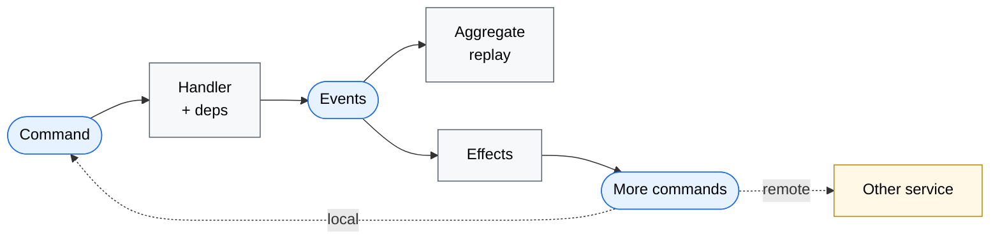
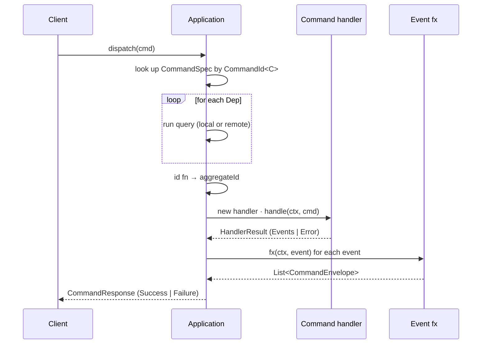
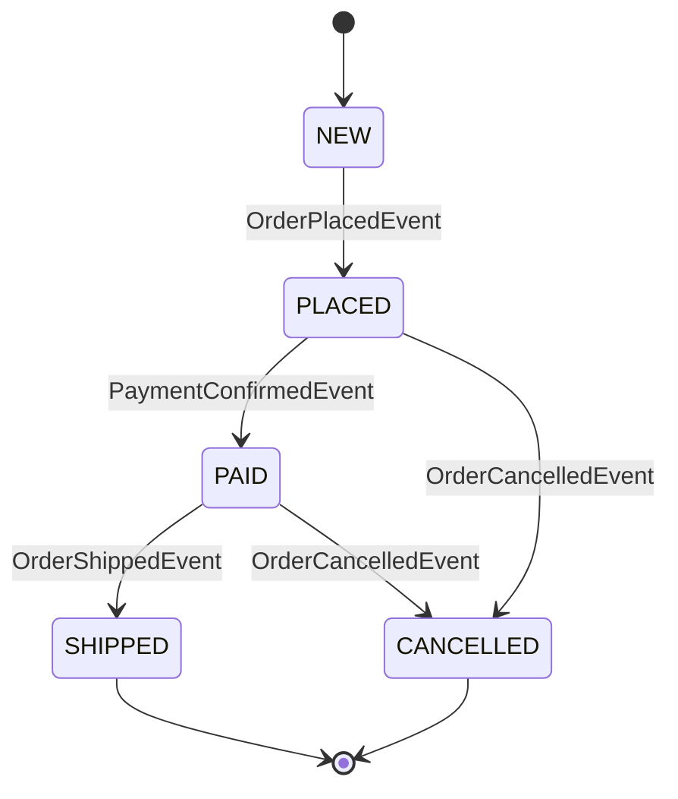
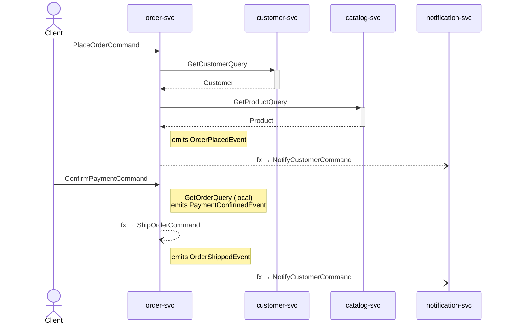

# edd-java

> Event-sourced CQRS for Java, with end-to-end compile-time type safety.

A Java port of the Clojure [edd-core](https://github.com/alpha-prosoft/edd-core) library. Every command, event, aggregate, query, and dependency is a record; every registration is type-checked by the compiler.



> [!NOTE]
> **API proposal.** The dispatcher runs end-to-end and is verified by 8 tests. Persistence, replay, schema validation, and wire serialization are not yet implemented — see [Status](#status).

---

## The core idea: typed IDs

```java
public static final CommandId<PlaceOrderCommand> PLACE_ORDER =
    CommandId.of("place-order", PlaceOrderCommand.class);
```

`CommandId<C>` is a typesafe-enum singleton — a real `enum` can't be generic, so this is the classic Bloch pattern. The same trick is applied to `EventId<E>`, `QueryId<Q, R>`, and `Dep<Q, T>`. Every other piece of typing falls out of these keys.

```java
m.regCmd(OrderIds.PLACE_ORDER, spec -> spec
    .handler(ShipOrderHandler.class)     // ❌ compile error: not CommandHandler<PlaceOrderCommand, ?>
    .build());
```

---

## Concepts

| | Naming | Implementation |
|---|---|---|
| **Command** | `PlaceOrderCommand` | `record … implements Command` |
| **Event** | `OrderPlacedEvent` | `record … implements Event` |
| **Aggregate** | `OrderAggregate` | `record … implements Aggregate` |
| **Query** | `GetOrderQuery` | `record … implements Query` |
| **Handler** | `PlaceOrderHandler` | `class … implements CommandHandler<C, A>` (no-arg ctor, new instance per dispatch) |
| **Effect** | `OrderPlacedEffect` | `class … implements EventFxHandler<E>` |

### Command lifecycle



---

## The Order example

Lives in `src/test/java/com/alphaprosoft/edd/order/`. Subpackages: `command/`, `event/`, `query/`, `effect/`.

### Module — aggregate type, set once

```java
Application app = Application.builder("order-svc")
    .module(OrderAggregate.class, OrderModule::register)
    .regQuery(OrderIds.GET_ORDER, getOrderHandler)
    .remoteResolver(remoteResolver)
    .build();
```

Inside the module the aggregate type is implicit. One module per aggregate.

### Commands and a sealed event hierarchy

```java
public record PlaceOrderCommand(UUID id, UUID customerId, UUID productId, int quantity)
        implements Command {}

public sealed interface OrderEvent extends Event
        permits OrderPlacedEvent, PaymentConfirmedEvent, OrderCancelledEvent, OrderShippedEvent {}
```

The aggregate's `applyEvent` is an **exhaustive switch with no `default`** — adding a variant is a compile error everywhere it needs to be handled:

```java
public OrderAggregate applyEvent(OrderEvent event) {
    return switch (event) {
        case OrderPlacedEvent e        -> /* … */;
        case PaymentConfirmedEvent _   -> /* … */;
        case OrderCancelledEvent _     -> /* … */;
        case OrderShippedEvent e       -> /* … */;
    };
}
```



### Deps — typed keys, wired at registration

```java
public final class OrderDeps {
    public static final Dep<GetCustomerQuery, Customer> CUSTOMER =
        Dep.remote("customer", Services.CUSTOMER_SVC, OrderIds.GET_CUSTOMER);
    public static final Dep<GetProductQuery, Product> PRODUCT =
        Dep.remote("product", Services.CATALOG_SVC, OrderIds.GET_PRODUCT);
    public static final Dep<GetOrderQuery, OrderAggregate> CURRENT_ORDER =
        Dep.local("order", OrderIds.GET_ORDER);
}
```

### Registration — handler is a class, deps chain in

```java
m.regCmd(OrderIds.PLACE_ORDER, spec -> spec
    .handler(PlaceOrderHandler.class)
    .dep(OrderDeps.CUSTOMER, (_, cmd) -> new GetCustomerQuery(cmd.customerId()))
    .dep(OrderDeps.PRODUCT,  (_, cmd) -> new GetProductQuery(cmd.productId()))
    .build())
```

After `.handler(PlaceOrderHandler.class)` the builder is `Builder<PlaceOrderCommand, OrderAggregate>` — every `.dep(KEY, fn)` types `cmd` as `PlaceOrderCommand` automatically. The framework creates a fresh handler per dispatch via a `ClassValue`-cached constructor.

### Handler reads deps with `ctx.get(KEY)`

```java
public final class PlaceOrderHandler implements CommandHandler<PlaceOrderCommand, OrderAggregate> {
    @Override
    public HandlerResult<OrderAggregate> handle(Context ctx, PlaceOrderCommand cmd) {
        Customer customer = ctx.get(OrderDeps.CUSTOMER);   // typed
        Product  product  = ctx.get(OrderDeps.PRODUCT);    // typed

        if (product.stock() < cmd.quantity()) {
            return HandlerResult.error("insufficient-stock");
        }
        Money total = product.price().times(cmd.quantity());
        return HandlerResult.of(new OrderPlacedEvent(cmd.id(), customer.id(), product.id(), cmd.quantity(), total));
    }
}
```

### Effects emit follow-up commands

```java
public final class PaymentConfirmedEffect implements EventFxHandler<PaymentConfirmedEvent> {
    @Override
    public List<CommandEnvelope<?>> fx(Context ctx, PaymentConfirmedEvent event) {
        return List.of(CommandEnvelope.local(
            new ShipOrderCommand(UUID.randomUUID(), event.id(), "TRACK-" + event.id())));
    }
}
```

`CommandEnvelope.local(cmd)` chains within this service; `CommandEnvelope.on(svc, cmd)` targets a remote service.

### Full cross-service flow



### Putting it together: `OrderModule`

```java
public static Module<OrderAggregate> register(Module<OrderAggregate> m) {
    return m
        .regCmd(OrderIds.PLACE_ORDER, spec -> spec
                .handler(PlaceOrderHandler.class)
                .dep(OrderDeps.CUSTOMER, (_, cmd) -> new GetCustomerQuery(cmd.customerId()))
                .dep(OrderDeps.PRODUCT,  (_, cmd) -> new GetProductQuery(cmd.productId()))
                .build())
        .regCmd(OrderIds.CONFIRM_PAYMENT, spec -> spec
                .handler(ConfirmPaymentHandler.class)
                .dep(OrderDeps.CURRENT_ORDER, (_, cmd) -> new GetOrderQuery(cmd.orderId()))
                .id((_, cmd) -> cmd.orderId())
                .build())
        // … CancelOrderCommand, ShipOrderCommand …
        .regEvent(OrderIds.ORDER_PLACED,      OrderModule::apply)
        .regEvent(OrderIds.PAYMENT_CONFIRMED, OrderModule::apply)
        // …
        .regEventFx(OrderIds.ORDER_PLACED,      new OrderPlacedEffect())
        .regEventFx(OrderIds.PAYMENT_CONFIRMED, new PaymentConfirmedEffect());
}
```

---

## Java 25 features used

| Feature | Where |
|---|---|
| Records | every `Command`, `Event`, `Aggregate`, `Query`, plus framework types (`CommandSpec`, `Dep`, `ContextImpl`, `HandlerResult`, `CommandResponse`, …) |
| Sealed interfaces | `OrderEvent`, `HandlerResult`, `CommandResponse`, `CommandSpec.Init`/`Builder` |
| Pattern matching for switch | `OrderAggregate.applyEvent`, `Application.dispatchTyped`, `CancelOrderHandler` |
| Record deconstruction in `case` | `case Events<A>(List<Event> es) -> …` in dispatcher |
| Unnamed `_` | every dep/id lambda `(_, cmd) -> …` |
| Unnamed pattern `case T _` | aggregate apply for events whose fields aren't read |
| Exhaustive switch on sealed | aggregate apply (no `default`) |
| `ClassValue` | per-handler-class constructor cache |

---

## Mapping to edd-core (Clojure)

| edd-core | edd-java |
|---|---|
| `(edd/reg-cmd :create-user handler :deps {…} :id-fn …)` | `m.regCmd(CREATE_USER, spec -> spec.handler(H.class).dep(KEY, fn).id(…).build())` |
| `(edd/reg-event :user-created (fn [agg evt] …))` | `m.regEvent(USER_CREATED, (agg, evt) -> …)` |
| `(edd/reg-event-fx :user-created (fn [ctx evt] …))` | `m.regEventFx(USER_CREATED, new UserCreatedEffect())` |
| `(edd/reg-query :get-user handler)` | `m.regQuery(GET_USER, handler)` |
| `(comp moduleA/register moduleB/register)` | `.module(A.class, A::register).module(B.class, B::register)` |
| Keyword `:create-user` | `CommandId<CreateUserCommand> CREATE_USER` |
| `(:user ctx)` from `:deps [:user …]` | `ctx.get(USER_DEP)` |

---

## Status

### Done

- [x] Typed `CommandId<C>`, `EventId<E>`, `QueryId<Q, R>`, `Dep<Q, T>` registries
- [x] Staged `CommandSpec.builder` (handler required first)
- [x] Handlers registered by `Class`, instantiated fresh per dispatch (cached constructor)
- [x] `.dep(KEY, fn)` chained on builder — no type witness needed
- [x] `Module<A>` — aggregate type pinned once
- [x] Sealed `HandlerResult` and `CommandResponse`
- [x] `regEventFx` + `CommandEnvelope` for cross-service effects
- [x] `RemoteResolver` seam for remote query resolution
- [x] Build-time validation: missing local query handler ⇒ `Application.build()` fails

### Not yet

- [ ] Aggregate replay from event store
- [ ] Postgres event store / OpenSearch view store
- [ ] Wire serialization (Jackson, edd-core-compatible)
- [ ] Schema validation
- [ ] Recursive fx dispatch
- [ ] Optimistic concurrency control
- [ ] AWS Lambda runtime
- [ ] Test fixture analogue of `edd.test.fixture.dal`

---

## Build

Java 25 + Maven 3.9+. With direnv, `.envrc` puts Corretto 25 on `PATH`.

```bash
mvn verify            # compile, test, Spotless check
mvn spotless:apply    # auto-format
```

Tooling: JUnit 5, Spotless (`palantir-java-format` 2.90.0).

---

## Credits

Designed after Robert Pofuk's [edd-core](https://github.com/alpha-prosoft/edd-core) (Clojure). The concepts — commands, events, aggregates, deps, id-fn, event-fx — come from there. The Java type-system choices (typed-enum IDs, sealed events, `Dep<Q, T>` heterogeneous map keys, `Module<A>`, staged builder, per-dispatch handler instantiation) are what make a port worthwhile in a language without runtime data-driven dispatch.
