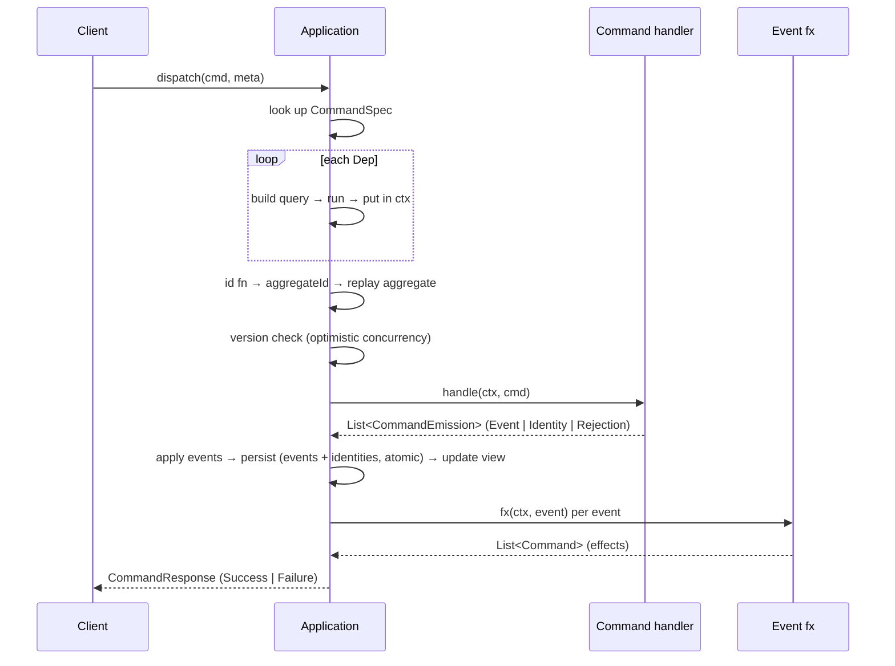
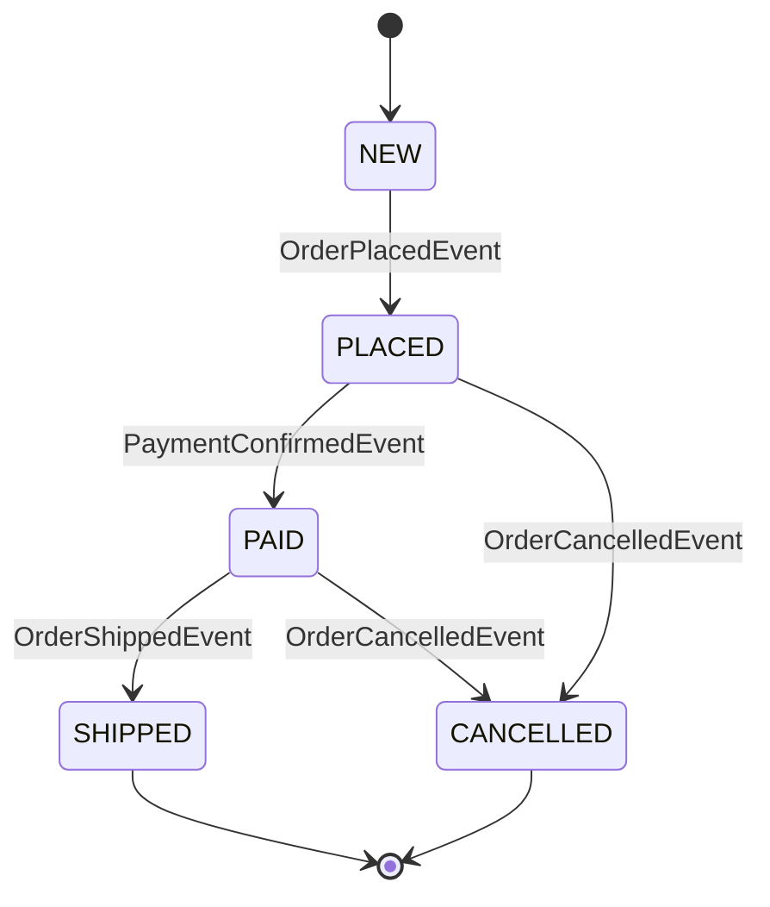

# edd-java

> Event-sourced CQRS for Java with end-to-end compile-time type safety.

A Java port of the Clojure [edd-core](https://github.com/alpha-prosoft/edd-core).
Everything — commands, events, aggregates, queries, deps — is a record.
Every registration is checked by `javac`.


> [!NOTE]
> **It runs.** The core model — dispatch, event persistence + replay, optimistic
> concurrency, identities/uniqueness, effects, schema validation, local **and** remote
> deps, top-level query routing — is implemented and tested. So are four live store
> backends (in-memory · Postgres · DynamoDB · S3), an Undertow **HTTP/2** server + client
> with JWT auth, and a CRaC/SnapStart **AWS Lambda** runtime. What's left is parity polish —
> see [Status](#status). The story below is real code you can run.

This README reads top to bottom as one story:

1. **[Core concepts](#core-concepts)** — what event sourcing + CQRS mean here, the request lifecycle, and every building block.
2. **[Getting started](#getting-started--build-the-order-service)** — write an Order service file by file, then dispatch a command.
3. **[How a dispatch flows](#how-a-dispatch-flows)** — what the framework does between `dispatch` and `CommandResponse`.
4. **[Going to production](#going-to-production)** — persist to a store, serve over HTTP/2, talk between services, deploy on Lambda.
5. **[Reference](#concept-reference)** — concept table, edd-core mapping, modules, status.

If you just want to see code, skip to [Getting started](#getting-started--build-the-order-service);
the concepts below are the *why* behind every line of it.

---

# Core concepts

New to event sourcing / CQRS, or coming from edd-core? Read this once; the rest of the guide is
mechanics. Everything here is implemented and tested in this repo — nothing aspirational.

## Event sourcing in one paragraph

State is **not** stored as rows you overwrite. Every change is an immutable **event** appended to an
**event store** (the single source of truth). An aggregate's current state is *derived* by replaying
its events in order — never read from a mutable record. This gives you a complete audit trail, the
ability to rebuild read models at will, and a natural fit for optimistic concurrency. The trade-off
is that "the current value" is a fold over history, so the framework does that fold for you on every
dispatch.

## CQRS in one paragraph

The **C**ommand side (writes) and the **Q**uery side (reads) are different paths with different
shapes. A **command** is a request to change something; it runs a handler that emits events and
never returns data. A **query** is a read; it returns data and never changes state. They don't even
share a store: commands write the event store, queries read a **view store** (a materialized
projection of aggregates). Separating them lets each scale and be modeled independently.

## The building blocks

| Concept | What it is | In Java |
|---|---|---|
| **Command** | An intent to change state (imperative: `PlaceOrder`) | `record … implements Command` |
| **Command handler** | Pure function: validate, decide, **emit** | `class … implements CommandHandler<C, A>` |
| **Event** | A fact that happened (past tense: `OrderPlaced`) | `record … implements Event` |
| **Aggregate** | The entity whose state is folded from its events | `record … implements Aggregate`, one `apply` per event |
| **Effect** | A follow-up command triggered *after* an event persists | `EventFxHandler<E>` → `List<Command>` |
| **Query** | A read against the view store | `record … implements Query` + a `QueryHandler<Q, R>` |
| **Dep** | A query result injected into a handler's context | `Dep<Q, T>`, local or `Dep.remote(...)` |
| **Identity** | A uniqueness reservation (a natural key → aggregate) | `Identity` emission |
| **Module** | A self-contained bundle of the above for one aggregate | `Module<A>` |

A command handler returns a flat `List<CommandEmission>` — a mix of **`Event`**, **`Identity`**, and
**`Rejection`**. The dispatcher partitions it: any `Rejection` fails the whole command (events
discarded); otherwise the events are persisted and the identities reserved, together, in one
transaction. This mirrors edd-core, where one handler commonly emits an event *and* claims a
uniqueness identity in the same response.

## The request lifecycle

What happens between `app.dispatch(cmd, meta)` and the `CommandResponse`:

1. **Look up** the `CommandSpec` for the command's type.
2. **Resolve deps** — for each declared `Dep`, build its query, run it (locally, or remotely via a
   `RemoteServiceClient`), and put the result in the `Context`. Deps resolve before the handler runs.
3. **Compute the aggregate id** (the command's `id()`, or a custom `id` function).
4. **Load + replay** the aggregate: fold its stored events into current state.
5. **Optimistic-concurrency check**: if the command carries a `version` and it doesn't match the
   replayed aggregate's version, fail with `concurrent-modification` — nothing is written.
6. **Run the handler** → `List<CommandEmission>`. Any `Rejection` ⇒ fail, discard everything.
7. **Apply** the new events to get the next aggregate state (and validate it if a state schema is set).
8. **Persist atomically**: append events + reserve identities in one transaction. A duplicate event
   sequence ⇒ `concurrent-modification`; a taken identity ⇒ `identity-conflict`; both roll the whole
   batch back.
9. **Update the view store** with the new aggregate snapshot.
10. **Run effects**: for each event, any registered `EventFxHandler` returns follow-up commands. The
    runtime dispatches them next (in-process, or — on AWS — by sending them to the router, which routes
    each to its owning service's queue).



## Effects — orchestration without a saga engine

An event is a fact; an **effect** is what you do about it. `EventFxHandler<E>` runs *after* its event
is persisted and returns more commands to dispatch. Use it for command chaining, **fan-out** (one
event → commands to several aggregates), cross-service workflows, and notifications. Because effects
are computed from persisted events, they never fire for a command that failed or rolled back.

Cross-service note: an edd-java effect is a plain `Command` with no target-service tag. In-process,
the dispatcher just runs it. On AWS, the runtime sends every effect to a **router** lambda that
forwards it to the owning service's queue by `cmdId` — so each routed command id must be globally
unique. (This is the one place edd-java diverges from edd-core, which tags effects with `:service`.)

## Context & request metadata

Every handler receives a `Context`. Beyond the resolved deps (`ctx.getDeps(KEY)`) and the current
aggregate (`ctx.aggregate()`), it carries the per-request envelope, `RequestMeta`:

- **`realm`** — the tenant; all storage is realm-scoped, so realms never see each other's data.
- **`user`** — the acting principal (id + role), from the verified JWT in the HTTP/Lambda runtimes.
- **`requestId`** — client-generated; the idempotency key (see below).
- **`interactionId`** — a session/correlation id, stable across one user interaction; invaluable when
  reading logs and tracing a flow across services.
- **`breadcrumbs`** — the causal path of a request. A client command is `[0]`; its first effect is
  `[0,0]`, the second `[0,1]`, an effect of that effect `[0,0,0]`, and so on. Breadcrumbs let you
  trace the whole tree of downstream service calls one command set off — and they bound effect
  recursion so a ping↔pong loop can't run forever.

## Guarantees you get for free

- **Idempotency** — a response is keyed by `(realm, requestId, breadcrumbs)`. Replay the same
  request (a browser retry, an SQS redelivery) and the stored response is returned without
  re-processing — no duplicate events.
- **Optimistic concurrency** — events carry a contiguous per-aggregate sequence with a uniqueness
  constraint. Two concurrent writers can't both extend the same aggregate; the loser gets
  `concurrent-modification` and retries against fresh state.
- **Uniqueness** — an `Identity` reserves a natural key (e.g. `email/ada@x.com`) for one aggregate.
  A second aggregate claiming a taken key fails with `identity-conflict`, atomically with its events.
- **Determinism** — command, event-apply, and effect handlers must be **pure** functions of their
  inputs (no clocks, no random, no I/O outside declared deps). The framework instantiates a fresh
  handler per dispatch and folds events deterministically, so replay always reproduces state.

## Stores

Two storage roles, each with pluggable backends that all pass one shared compliance suite:

| Role | What it holds | Backends |
|---|---|---|
| **Event store** | the immutable event log (source of truth) + command/response logs + identities | in-memory · Postgres · DynamoDB |
| **View store** | materialized aggregate snapshots for queries (latest + version history) | in-memory · Postgres · S3 |

Both are realm-scoped. The view store additionally puts the **service** in its key, so services
sharing one bucket/table never collide; the event store isolates services at the deployment level (a
per-service table prefix / database). Swapping a backend is a one-line change at assembly time, and
the store derives its service from the app itself — see [Going to production](#persist-events-and-views).

---

# Getting started — build the Order service

Walk through every file you'd write for a minimal order-processing service:
place an order (needs a customer and a product), confirm payment, ship, cancel.
The full working example lives under
`modules/store/edd-event-store-memory/src/test/java/com/alphaprosoft/edd/order/`.

**Prerequisites:** Java 25 + Maven 3.9+.

## 1. Domain types

Plain Java records — no framework dependency.
Each record has two builder factories:

- `Record.builder()` — empty builder, every field starts at its default.
- `Record.builder(existing)` — pre-populated from an existing instance,
  so you can override only the fields you want to change.

```java
public record Money(long amountCents, String currency) {

  public static Money usd(long cents) {
    return new Money(cents, "USD");
  }

  public Money times(int n) {
    return new Money(amountCents * n, currency);
  }

  public static Builder builder() {
    return new Builder();
  }

  public static Builder builder(Money existing) {
    return new Builder(existing);
  }

  public static final class Builder {

    private long amountCents;
    private String currency;

    private Builder() {}

    private Builder(Money m) {
      this.amountCents = m.amountCents;
      this.currency = m.currency;
    }

    public Builder amountCents(long amountCents) {
      this.amountCents = amountCents;
      return this;
    }

    public Builder currency(String currency) {
      this.currency = currency;
      return this;
    }

    public Money build() {
      return new Money(amountCents, currency);
    }
  }
}
```

`Customer`, `Product`, and the `OrderStatus` enum follow the same pattern.
Every other record in this guide (commands, events, queries, the aggregate)
has the same `builder()` / `builder(existing)` pair.

## 2. Events

Past-tense records, grouped as a **sealed interface** so the apply switch is exhaustive:

```java
public sealed interface OrderEvent extends Event
    permits
        OrderPlacedEvent,
        PaymentConfirmedEvent,
        OrderCancelledEvent,
        OrderShippedEvent {}

public record OrderPlacedEvent(
    UUID id,
    UUID customerId,
    UUID productId,
    int quantity,
    Money total)
    implements OrderEvent {
  // … builder() / builder(existing) — same pattern as Money
}

public record PaymentConfirmedEvent(UUID id, Money amount) implements OrderEvent {}

public record OrderCancelledEvent(UUID id, String reason) implements OrderEvent {}

public record OrderShippedEvent(UUID id, String trackingNumber) implements OrderEvent {}
```

## 3. The Aggregate

A record + **one static apply method per event**.
Each method has the shape `(A agg, E event) -> A`, matching `EventHandler<E, A>`,
so the framework can use them as method references in step 10.

Two rules make the apply methods short:

- **No initial-aggregate factory.** Replay folds from `null` — an aggregate doesn't exist
  until its creation event. `builder(agg)` is **null-safe**: given `null` it starts empty,
  so the creation apply reads the event (`e.id()`) and later applies copy from the prior state.
- **The library owns `version`.** It's stamped after every fold from the event count, so apply
  methods never set it. One less field to get right.

```java
public record OrderAggregate(
    UUID id,
    long version,
    OrderStatus status,
    UUID customerId,
    UUID productId,
    int quantity,
    Money total,
    String trackingNumber)
    implements Aggregate {

  public static OrderAggregate placed(OrderAggregate agg, OrderPlacedEvent e) {
    return OrderAggregate.builder(agg)
        .id(e.id())
        .status(OrderStatus.PLACED)
        .customerId(e.customerId())
        .productId(e.productId())
        .quantity(e.quantity())
        .total(e.total())
        .build();
  }

  public static OrderAggregate paid(OrderAggregate agg, PaymentConfirmedEvent event) {
    return OrderAggregate.builder(agg).status(OrderStatus.PAID).build();
  }

  public static OrderAggregate cancelled(OrderAggregate agg, OrderCancelledEvent event) {
    return OrderAggregate.builder(agg).status(OrderStatus.CANCELLED).build();
  }

  public static OrderAggregate shipped(OrderAggregate agg, OrderShippedEvent e) {
    return OrderAggregate.builder(agg)
        .status(OrderStatus.SHIPPED)
        .trackingNumber(e.trackingNumber())
        .build();
  }

  // builder() / builder(existing) omitted — same pattern as Money, but builder(null) is empty
}
```

`builder(agg)` copies every field, then the chained setters override only the ones the event changes —
no version, no eight-argument constructor calls with seven fields unchanged.

For an *accumulator* aggregate with no single creation event (a counter where either event can be first),
read the prior scalar through `Optional` and let the library fill version:

```java
public static CounterAggregate incremented(CounterAggregate agg, IncrementedEvent e) {
  long count = Optional.ofNullable(agg).map(CounterAggregate::count).orElse(0L) + e.amount();
  return new CounterAggregate(e.id(), 0, count, null); // version set by the library
}
```

## 4. Commands

Imperative verb + `Command` suffix:

```java
public record PlaceOrderCommand(
    UUID id,
    UUID customerId,
    UUID productId,
    int quantity)
    implements Command {}

public record ConfirmPaymentCommand(UUID id, UUID orderId, Money amount) implements Command {}

public record CancelOrderCommand(UUID id, UUID orderId, String reason) implements Command {}

public record ShipOrderCommand(UUID id, UUID orderId, String trackingNumber) implements Command {}
```

## 5. Queries

```java
public record GetOrderQuery(UUID id) implements Query {}

public record GetCustomerQuery(UUID id) implements Query {}

public record GetProductQuery(UUID id) implements Query {}
```

## 6. Typed IDs — declared on the module

`CommandId<C>`, `EventId<E>`, and `QueryId<Q, R>` are typed singletons
(typesafe-enum pattern — Java's `enum` can't carry generics).
They live as `public static final` fields **on the module class itself**, so a module
and its IDs travel as one composable unit — there's no separate registry class to keep in sync.
`OrderModule` declares them here; section 10 adds the `register()` factory to the same class.

```java
public final class OrderModule {

  public static final CommandId<PlaceOrderCommand> PLACE_ORDER =
      CommandId.of("place-order", PlaceOrderCommand.class);
  public static final CommandId<ConfirmPaymentCommand> CONFIRM_PAYMENT =
      CommandId.of("confirm-payment", ConfirmPaymentCommand.class);
  public static final CommandId<CancelOrderCommand> CANCEL_ORDER =
      CommandId.of("cancel-order", CancelOrderCommand.class);
  public static final CommandId<ShipOrderCommand> SHIP_ORDER =
      CommandId.of("ship-order", ShipOrderCommand.class);

  public static final EventId<OrderPlacedEvent> ORDER_PLACED =
      EventId.of("order-placed", OrderPlacedEvent.class);
  public static final EventId<PaymentConfirmedEvent> PAYMENT_CONFIRMED =
      EventId.of("payment-confirmed", PaymentConfirmedEvent.class);
  public static final EventId<OrderCancelledEvent> ORDER_CANCELLED =
      EventId.of("order-cancelled", OrderCancelledEvent.class);
  public static final EventId<OrderShippedEvent> ORDER_SHIPPED =
      EventId.of("order-shipped", OrderShippedEvent.class);

  // QueryId<Q, R> carries the query type AND the response type,
  // so anyone holding the ID knows what comes back:
  public static final QueryId<GetOrderQuery, OrderAggregate> GET_ORDER =
      QueryId.of("get-order", GetOrderQuery.class, OrderAggregate.class);
  public static final QueryId<GetCustomerQuery, Customer> GET_CUSTOMER =
      QueryId.of("get-customer", GetCustomerQuery.class, Customer.class);
  public static final QueryId<GetProductQuery, Product> GET_PRODUCT =
      QueryId.of("get-product", GetProductQuery.class, Product.class);

  // ... register() — see step 10
}
```

## 7. Deps — typed keys into the resolved context

A `Dep<Q, T>` says: *fetch a `T` by sending a `Q` query*.
Just a named pointer to a `QueryId` — no query lambda baked in
(that's per-command, at registration time):

```java
public final class OrderDeps {

  public static final Dep<GetCustomerQuery, Customer> CUSTOMER =
      Dep.of("customer", OrderModule.GET_CUSTOMER);

  public static final Dep<GetProductQuery, Product> PRODUCT =
      Dep.of("product", OrderModule.GET_PRODUCT);

  public static final Dep<GetOrderQuery, OrderAggregate> CURRENT_ORDER =
      Dep.of("order", OrderModule.GET_ORDER);
}
```

## 8. Command handlers

One class per command. Public no-arg constructor;
the framework creates a fresh instance for every dispatch.
Read deps via `ctx.getDeps(KEY)`; the current aggregate state is on `ctx.aggregate()`.

A handler returns a **`List<CommandEmission>`** — a flat list mixing any of
`Event`, `Identity`, and `Rejection`. The dispatcher partitions it:
any `Rejection` fails the whole command (events discarded);
otherwise events and identities flow into the success.
This mirrors edd-core, where one handler commonly emits an event **and** reserves
a uniqueness identity in the same response.

```java
public final class PlaceOrderHandler
    implements CommandHandler<PlaceOrderCommand, OrderAggregate> {

  @Override
  public List<CommandEmission> handle(CommandContext<OrderAggregate> ctx, PlaceOrderCommand cmd) {
    Customer customer = ctx.getDeps(OrderDeps.CUSTOMER); // typed: Customer
    Product product = ctx.getDeps(OrderDeps.PRODUCT); // typed: Product

    if (product.stock() < cmd.quantity()) {
      return List.of(Rejection.of("insufficient-stock"));
    }
    Money total = product.price().times(cmd.quantity());

    return List.of(
        OrderPlacedEvent.builder()
            .id(cmd.id())
            .customerId(customer.id())
            .productId(product.id())
            .quantity(cmd.quantity())
            .total(total)
            .build());
  }
}
```

Emit an event **and** reserve an identity together — the `aggregateId` is stamped
by the dispatcher from the command's aggregate id:

```java
return List.of(
    PaymentConfirmedEvent.builder().id(cmd.orderId()).amount(cmd.amount()).build(),
    Identity.builder().name("payment-" + cmd.orderId()).build()); // uniqueness reservation
```

`CommandEmission` is a sealed union (`Event | Identity | Rejection`).
`Rejection` is named to avoid clashing with `java.lang.Error`.

## 9. Effects — follow-up commands

`EventFxHandler<E>` runs after an event is emitted
and returns commands to dispatch next:

```java
public final class PaymentConfirmedEffect
    implements EventFxHandler<PaymentConfirmedEvent> {

  @Override
  public List<Command> fx(Context ctx, PaymentConfirmedEvent event) {
    return List.of(
        ShipOrderCommand.builder()
            .id(UUID.randomUUID())
            .orderId(event.id())
            .trackingNumber("TRACK-" + event.id())
            .build());
  }
}
```

Effects produce `List<Command>` directly —
the framework returns them on `CommandResponse.Success.effects()`
for the caller to dispatch.

## 10. The module — wire it all together

A `static register()` in the same `OrderModule` class as the IDs (step 6). It returns a
self-contained `Module<OrderAggregate>` — the aggregate type is named once, and the IDs are
referenced unqualified since they're fields on this class:

```java
public final class OrderModule {

  // CommandId / EventId / QueryId fields from step 6 …

  public static Module<OrderAggregate> register() {
    return Module.builder(OrderAggregate.class)
        .regCmd(PLACE_ORDER, spec -> spec
            .handler(PlaceOrderHandler.class)
            .dep(OrderDeps.CUSTOMER, (_, cmd) ->
                GetCustomerQuery.builder()
                    .id(cmd.customerId())
                    .build())
            .dep(OrderDeps.PRODUCT, (_, cmd) ->
                GetProductQuery.builder()
                    .id(cmd.productId())
                    .build())
            .build())

        .regCmd(CONFIRM_PAYMENT, spec -> spec
            .handler(ConfirmPaymentHandler.class)
            .dep(OrderDeps.CURRENT_ORDER, (_, cmd) ->
                GetOrderQuery.builder()
                    .id(cmd.orderId())
                    .build())
            .id((_, cmd) -> cmd.orderId()) // aggregate id ≠ cmd id
            .build())

        .regCmd(CANCEL_ORDER, spec -> spec
            .handler(CancelOrderHandler.class)
            .dep(OrderDeps.CURRENT_ORDER, (_, cmd) ->
                GetOrderQuery.builder()
                    .id(cmd.orderId())
                    .build())
            .id((_, cmd) -> cmd.orderId())
            .build())

        .regCmd(SHIP_ORDER, spec -> spec
            .handler(ShipOrderHandler.class)
            .dep(OrderDeps.CURRENT_ORDER, (_, cmd) ->
                GetOrderQuery.builder()
                    .id(cmd.orderId())
                    .build())
            .id((_, cmd) -> cmd.orderId())
            .build())

        .regApply(ORDER_PLACED, OrderAggregate::placed)
        .regApply(PAYMENT_CONFIRMED, OrderAggregate::paid)
        .regApply(ORDER_CANCELLED, OrderAggregate::cancelled)
        .regApply(ORDER_SHIPPED, OrderAggregate::shipped)

        .regFx(PAYMENT_CONFIRMED, new PaymentConfirmedEffect())

        // the order aggregate is owned here, so its read query lives in the module:
        .regQuery(GET_ORDER, (ctx, q) -> ctx.<OrderAggregate>getAggregate(q.id()).orElse(null))
        .build();
  }
}
```

Things to notice:

- `Module.builder(OrderAggregate.class)` — the aggregate type is declared **once**, here.
  It's never repeated at the call site (step 10 ends in `.build()`, returning a `Module<OrderAggregate>`).
- `.handler(PlaceOrderHandler.class)` — pass the class, not an instance.
  After this line the builder knows `C = PlaceOrderCommand`,
  so the `.dep(...)` lambdas type `cmd` automatically.
- `.dep(KEY, fn)` — `KEY`'s `Q` constrains the lambda's return type;
  `KEY`'s `T` is what `ctx.getDeps(KEY)` returns.
- `.id((_, cmd) -> cmd.orderId())` — when the **command id** differs from the **aggregate id**.
- `.regApply(EVENT_ID, OrderAggregate::method)` — each event gets *its own* apply function.
- `.regFx(EVENT_ID, new SomeEffect())` — register a follow-up effect for an event.
- `.regQuery(GET_ORDER, …)` — a **module-level query**. Because its handler is self-contained
  (it reads the order aggregate from the view store via `ctx.getAggregate`), it belongs with the
  aggregate that owns it. Queries whose handlers need infrastructure injected at assembly time
  are registered on the `Application` instead — see step 11.

## 11. Wire up the Application — global queries

`GET_ORDER` is already registered (it lives in the module, step 10). What's left are the
**global queries**: reference-data lookups whose handlers close over infrastructure that only
exists at assembly time — here, `customerStore` / `productStore` injected by the host. They can't
live in `register()` because the module doesn't know about those stores, so they're registered
directly on the `Application`:

```java
QueryHandler<GetCustomerQuery, Customer> getCustomer =
    (ctx, q) -> customerStore.findById(q.id());

QueryHandler<GetProductQuery, Product> getProduct =
    (ctx, q) -> productStore.findById(q.id());

Application app = Application.builder("order-svc")
    .module(OrderModule::register) // brings the commands, applies, fx, and GET_ORDER
    .regQuery(OrderModule.GET_CUSTOMER, getCustomer) // global: backed by an injected store
    .regQuery(OrderModule.GET_PRODUCT, getProduct) // global: backed by an injected store
    .build();
```

The rule of thumb: **self-contained queries go in the module** (read-your-own-state via
`ctx.getAggregate`/deps), **infrastructure-backed queries go on the Application**. Both share one
registry, so `.build()` validates that every `Dep` has a registered query handler regardless of
where it was declared — fail-fast on misconfiguration.

`.module(...)` takes a no-arg `Supplier` (`OrderModule::register`, the common case). If a module's
registrations need app identity or config, give it an **`(app, config)` factory** instead — built at
`.build()` time, symmetric with the store factories below:

```java
.module((app, config) -> OrderModule.register(app.serviceName(), config))
```

## 12. Dispatch

```java
PlaceOrderCommand cmd = PlaceOrderCommand.builder()
    .id(UUID.randomUUID())
    .customerId(customerId)
    .productId(productId)
    .quantity(3)
    .build();

CommandResponse resp = app.dispatch(cmd, RequestMeta.newRequest());

switch (resp) {
  case CommandResponse.Success(UUID aggregateId, var events, var identities, var effects) -> {
    // events     — what happened, persist to event store
    // identities — uniqueness reservations to persist
    // effects    — follow-up commands to dispatch next
    // aggregateId — id this dispatch is about
  }
  case CommandResponse.Failure(String code, var details) -> {
    // handle error
  }
}
```

That's the whole flow. Pattern matching with record deconstruction (Java 21+)
gives you typed access to every field in one line.

---

# How a dispatch flows

The step-by-step is in [The request lifecycle](#the-request-lifecycle) above — dispatch → resolve deps
→ replay → version check → handler → persist → view update → effects. Here's how that looks for the
Order aggregate specifically: each command drives a state transition, and each transition *is* an
event being applied during replay.

Order aggregate state machine:



---

# Going to production

The walkthrough dispatched against an in-memory app. The same `Application` grows into a
real service by swapping in pieces at build time — nothing in your handlers changes.

## Persist events and views

Point it at a backend by resolving each store from a `(app, config)` factory — so the store derives
its service partition from the app's own `serviceName()` and you never wire it twice (two services on
one shared backend can't collide):

```java
Application app = Application.builder("order-svc")
    .config(config) // handed to the store factories
    .eventStore(PostgresEventStore::fromConfig) // commands → events, replayed per dispatch
    .viewStore(PostgresViewStore::fromConfig) // aggregate snapshots for queries
    .module(OrderModule::register) // commands, applies, fx, and GET_ORDER
    .regQuery(OrderModule.GET_CUSTOMER, getCustomer) // global reference-data queries
    .regQuery(OrderModule.GET_PRODUCT, getProduct)
    .build();
```

(For tests, the instance overloads still take a pre-built store, e.g. `.eventStore(InMemoryEventStore.builder().build())`.)

Every store is a fluent builder, never a constructor, and every backend passes the **same**
compliance suite — switching is a one-line change:

| Backend | Event store | View store |
|---|---|---|
| In-memory | `InMemoryEventStore` | `InMemoryViewStore` |
| Postgres | `PostgresEventStore` | `PostgresViewStore` |
| DynamoDB | `DynamoDbEventStore` | — |
| S3 | — | `S3ViewStore` |

With an event store wired, `ctx.aggregate()` is the live state folded from stored events,
optimistic concurrency rejects stale `Command.version()`, and identities enforce uniqueness.

## Serve it over HTTP/2

`edd-java-undertow` wraps any `Application` in an HTTP/2 server speaking the edd wire protocol
(`POST /api/command`, `POST /api/query`), with optional JWT auth:

```java
EddServer server = new EddServer(OrderApp.build(), 8443, Tls.serverContext());
server.start();
```

```bash
curl -sk --http2 https://localhost:8443/api/command \
  -H 'content-type: application/json' \
  -d '{"cmdId":"place-order","command":{ … },"meta":{}}'
```

## Talk to another service

A `Dep.remote(name, service, queryId)` is resolved over the wire by a `RemoteServiceClient`.
The greeter demo resolves its customer dep from a separate customer-svc, and even forwards
inbound `get-customer` queries wholesale via `regRemoteQuery`:

```java
RemoteServiceClient remote =
    new HttpServiceClient(Map.of(CustomerIds.SERVICE, "https://customer-svc:8443"));

Application greeter = Application.builder(GreeterIds.SERVICE)
    .remoteClient(remote)
    .eventStore(eventStore)
    .viewStore(viewStore)
    .module(GreeterModule::register)
    .regRemoteQuery(CustomerIds.GET_CUSTOMER, CustomerIds.SERVICE) // top-level routing
    .build();
```

`docker compose up --build` starts both demo services so greeter-svc resolves customers
from customer-svc across the network. For tests, `InProcessServiceRouter` wires services
in one JVM and `edd-java-testkit`'s `InProcessSaga` runs command→effects→command loops
synchronously.

## Deploy on AWS Lambda

`edd-java-aws` provides a CRaC/SnapStart `LambdaRuntime` plus ingestion filters
(`ApiFilter`, `SqsFilter`, `S3Filter`, `DirectFilter`) and effect routers
(`Router`, `SqsRouter`), with EMF metrics and X-Ray trace propagation. The same
`Application` you tested in-process is the handler.

## Configure without recompiling

Every tunable — JWT issuer, store connection, table prefix — is read through one `Config`
(defaults → file → `-Dedd.*` → `EDD_*`, Spring-style relaxed binding). See [CONFIG.md](CONFIG.md).

---

# Concept reference

| Concept | Naming | Implementation |
|---|---|---|
| **Command** | `PlaceOrderCommand` | `record … implements Command` |
| **Event** | `OrderPlacedEvent` | `record … implements Event` (sealed parent per aggregate) |
| **Aggregate** | `OrderAggregate` | `record … implements Aggregate`, one static apply per event |
| **Query** | `GetOrderQuery` | `record … implements Query` |
| **Handler** | `PlaceOrderHandler` | `class … implements CommandHandler<C, A>`, public no-arg ctor, returns `List<CommandEmission>` |
| **Emission** | `Event` / `Identity` / `Rejection` | sealed `CommandEmission` — what a handler returns |
| **Effect** | `PaymentConfirmedEffect` | `class … implements EventFxHandler<E>`, returns `List<Command>` |
| **CommandId** | `PLACE_ORDER` (on `OrderModule`) | `CommandId<C>` typed singleton |
| **EventId** | `ORDER_PLACED` (on `OrderModule`) | `EventId<E>` typed singleton |
| **QueryId** | `GET_ORDER` (on `OrderModule`) | `QueryId<Q, R>` typed singleton |
| **Dep** | `CUSTOMER` (in `OrderDeps`) | `Dep<Q, T>` typed key referring to a `QueryId` |

---

# Java 25 features used

| Feature | Where |
|---|---|
| Records | every `Command`, `Event`, `Aggregate`, `Query`, plus framework types |
| Sealed interfaces | `OrderEvent`, `CommandEmission`, `CommandResponse`, `CommandSpec.Init`/`Builder` |
| Pattern matching for switch | `Application.dispatchTyped`, `CancelOrderHandler` |
| Record deconstruction in `case` | dispatcher + caller-side `switch` on `CommandResponse` |
| Unnamed `_` | every dep/id lambda `(_, cmd) -> …` |
| Unnamed pattern `case T _` | event apply for events whose fields aren't read |
| `ClassValue` | per-handler-class constructor cache |

---

# Mapping to edd-core (Clojure)

| edd-core | edd-java |
|---|---|
| `(edd/reg-cmd :create-user handler :deps {…} :id-fn …)` | `m.regCmd(CREATE_USER, spec -> spec.handler(H.class).dep(KEY, fn).id(…).build())` |
| `(edd/reg-event :user-created (fn [agg evt] …))` | `m.regApply(USER_CREATED, (agg, evt) -> …)` |
| `(edd/reg-event-fx :user-created (fn [ctx evt] …))` | `m.regFx(USER_CREATED, new UserCreatedEffect())` |
| handler returns `[{:event-id …} {:identity …}]` | handler returns `List.of(event, Identity.builder()…build())` |
| handler returns `{:error …}` | handler returns `List.of(Rejection.of("code"))` |
| `(edd/reg-query :get-user handler)` | `m.regQuery(GET_USER, handler)` |
| `(edd/reg-query :get-user handler :deps {…})` | `m.regQuery(GET_USER, spec -> spec.handler(h).dep(KEY, fn).build())` |
| `(comp moduleA/register moduleB/register)` | `.module(A::register).module(B::register)` |
| Keyword `:create-user` | `CommandId<CreateUserCommand> CREATE_USER` on the module class |
| `(:user ctx)` from `:deps [:user …]` | `ctx.getDeps(USER_DEP)` |
| `(:realm (:meta ctx))` / `(:user (:meta ctx))` | `ctx.realm()` / `ctx.user()` (from `RequestMeta`) |
| `:deps {:x {:service :other-svc :query …}}` | `Dep.remote("x", "other-svc", QUERY_ID)` + `RemoteServiceClient` |
| aggregate/event `:meta :annotations` | `EventMeta.annotations()` (provenance folded in) / `ctx.annotations()` |

---

# Status

The core model and runtime are implemented and tested. What remains is parity
polish against edd-core — tracked in detail in [SUMMARY.md](SUMMARY.md).

### Done

**Type-safe model**
- [x] Typed `CommandId<C>`, `EventId<E>`, `QueryId<Q, R>`, `Dep<Q, T>`
- [x] Staged `CommandSpec.builder` (handler required first); `.dep(KEY, fn)` chained, no type witness
- [x] Handlers registered by `Class`, instantiated fresh per dispatch (cached constructor)
- [x] `ctx.getDeps(KEY)` one-call typed dep lookup; `ctx.aggregate()` typed current state
- [x] `Module<A>` — aggregate type pinned once; `regApply` (one apply per event), `regFx` (effects)
- [x] Handler returns sealed `List<CommandEmission>` (`Event | Identity | Rejection`); dispatcher partitions, any `Rejection` fails the command
- [x] Sealed `CommandResponse` (`Success` carries `events` + `identities` + `effects`)
- [x] Build-time validation: missing query handler ⇒ `Application.build()` fails

**Dispatch & persistence**
- [x] Aggregate replay — apply functions folded over stored events; contiguous `eventSeq`
- [x] Event metadata stamping (`realm`, `userId`, `role`, `createdOn`, `requestId`) via `StoredEvent`/`EventMeta`
- [x] Identity persistence + uniqueness enforcement (`identity-conflict` on clash)
- [x] Optimistic concurrency — `Command.version()` vs replayed aggregate ⇒ `concurrent-modification`
- [x] `RequestMeta` carries tenant `realm` + acting `User`; `ctx.realm()` / `ctx.user()` / `ctx.annotations()`
- [x] Query-level deps, resolved (recursively) before the handler runs
- [x] Schema validation, idempotency / response-cache dedup, command batching

**Stores** (all pass a shared fail-hard compliance suite)
- [x] Event store: in-memory · Postgres · DynamoDB
- [x] View store: in-memory · Postgres · S3
- [x] Storage JSON envelope (`{kind,name,meta,spec}`) via `edd-java-json` + `TypeRegistry`

**Runtime**
- [x] Cross-service deps (`Dep.remote`) + top-level query routing (`regRemoteQuery`)
- [x] Undertow HTTP/2 server + client (`EddServer` / `HttpServiceClient`), JWT auth (HS256 + RS256/JWKS)
- [x] AWS Lambda runtime (CRaC/SnapStart); SQS/API/S3/Direct ingestion filters; effect routers; EMF metrics; X-Ray
- [x] `InProcessServiceRouter` + `edd-java-testkit` `InProcessSaga` for synchronous saga tests
- [x] Unified `Config` (defaults → file → `-Dedd.*` → `EDD_*`)

### Not yet (parity polish — see [SUMMARY.md](SUMMARY.md))

- [ ] JWT `exp`/`aud`/`iss` claim validation (signature is verified today)
- [ ] Query `:consumes` input validation; schema coercion/defaulting
- [ ] Concurrent-modification retry with backoff
- [ ] Aggregate history/annotations projection; `reg-service-schema` + OpenAPI generation
- [ ] HTTP surface extras: health check, CORS, gzip, GET query-string form
- [ ] Per-request cache; Cognito specifics; JWKS auto-refresh; Secrets Manager

---

# Build

Java 25 + Maven 3.9+ (multi-module reactor).
With direnv, `.envrc` puts Corretto 25 on `PATH`.

```bash
mvn verify            # compile, test, Spotless check — all modules
mvn spotless:apply    # auto-format
docker compose up --build   # run the two demo services over HTTP/2
```

The Postgres store suites connect to `localhost:5432` (start it with `docker compose up postgres`).
Tooling: JUnit 5, Spotless (`palantir-java-format` 2.90.0).

### Modules

```
edd-java/                       parent reactor pom
  modules/
    edd-java-core/              framework — command/query model, Application, dispatch, replay, stores SPI
    edd-java-json/              storage JSON codec ({kind,name,meta,spec} envelope + TypeRegistry)
    edd-java-testkit/           InProcessSaga — synchronous command→effects saga for tests
    runtime/
      edd-java-undertow/        HTTP/2 server + client, JwtAuthFilter, JwksKeys, TLS
      edd-java-aws/             CRaC/SnapStart Lambda runtime; SQS/API/S3/Direct filters; routers; EMF; X-Ray
    store/
      edd-store-compliance/     shared fail-hard JUnit suites every store impl must pass
      edd-event-store-{memory,postgres,dynamodb}/
      edd-view-store-{memory,postgres,s3}/
    demo/
      edd-demo-customer-svc/    publishes the get-customer contract
      edd-demo-greeter-svc/     greet-customer (remote dep) + get-greeting + top-level routing
```

---

# Credits

Designed after Robert Pofuk's [edd-core](https://github.com/alpha-prosoft/edd-core) (Clojure).
All concepts come from there. The Java type-system choices —
typed-enum IDs, sealed events, `Dep<Q, T>`, `Module<A>`, staged builder,
per-dispatch handler instantiation, per-event apply registration —
are what make a port worthwhile in a language without runtime data-driven dispatch.
