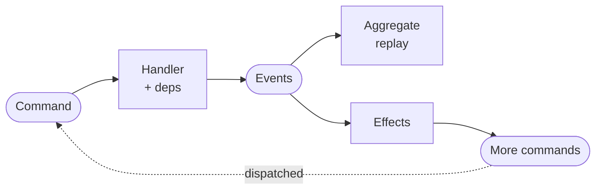
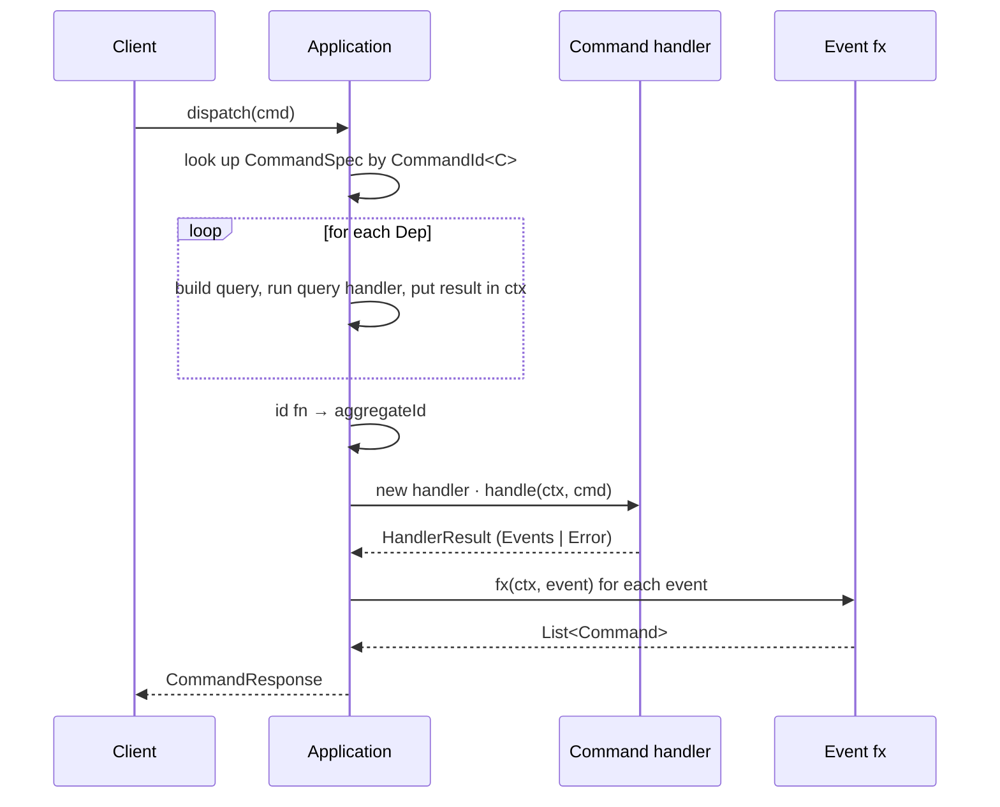
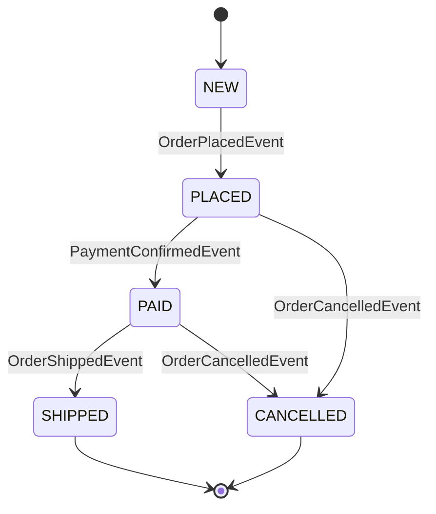

# edd-java

> Event-sourced CQRS for Java with end-to-end compile-time type safety.

A Java port of the Clojure [edd-core](https://github.com/alpha-prosoft/edd-core).
Everything — commands, events, aggregates, queries, deps — is a record.
Every registration is checked by `javac`.



> [!NOTE]
> **API proposal.** Dispatcher runs and is verified by 8 tests.
> Persistence, replay, schema validation, and wire serialization are not yet implemented — see [Status](#status).

---

# Getting started — build the Order service

Walk through every file you'd write for a minimal order-processing service:
place an order (needs a customer and a product), confirm payment, ship, cancel.
The full working example lives under `src/test/java/com/alphaprosoft/edd/order/`.

**Prerequisites:** Java 25 + Maven 3.9+.

## 1. Domain types

Plain Java records — no framework dependency.
Each record has two builder factories:

- `Record.builder()` — empty builder, every field starts at its default.
- `Record.builder(existing)` — pre-populated from an existing instance,
  so you can override only the fields you want to change.

```java
public record Money(long amountCents, String currency) {

    public static Money usd(long cents) {
        return new Money(cents, "USD");
    }

    public Money times(int n) {
        return new Money(amountCents * n, currency);
    }

    public static Builder builder() {
        return new Builder();
    }

    public static Builder builder(Money existing) {
        return new Builder(existing);
    }

    public static final class Builder {

        private long amountCents;
        private String currency;

        private Builder() {}

        private Builder(Money m) {
            this.amountCents = m.amountCents;
            this.currency = m.currency;
        }

        public Builder amountCents(long amountCents) {
            this.amountCents = amountCents;
            return this;
        }

        public Builder currency(String currency) {
            this.currency = currency;
            return this;
        }

        public Money build() {
            return new Money(amountCents, currency);
        }
    }
}
```

`Customer`, `Product`, and the `OrderStatus` enum follow the same pattern.
Every other record in this guide (commands, events, queries, the aggregate)
has the same `builder()` / `builder(existing)` pair.

## 2. Events

Past-tense records, grouped as a **sealed interface** so the apply switch is exhaustive:

```java
public sealed interface OrderEvent extends Event
        permits
                OrderPlacedEvent,
                PaymentConfirmedEvent,
                OrderCancelledEvent,
                OrderShippedEvent {}

public record OrderPlacedEvent(
        UUID id,
        UUID customerId,
        UUID productId,
        int quantity,
        Money total)
        implements OrderEvent {
    // … builder() with .from(...) — same pattern as Money
}

public record PaymentConfirmedEvent(UUID id, Money amount) implements OrderEvent {}
public record OrderCancelledEvent(UUID id, String reason)  implements OrderEvent {}
public record OrderShippedEvent(UUID id, String trackingNumber) implements OrderEvent {}
```

## 3. The Aggregate

A record + **one static apply method per event**.
Each method has the shape `(A agg, E event) -> A`, matching `EventHandler<E, A>`,
so the framework can use them as method references in step 11.

Every apply method uses `builder(agg)` and only spells out the fields it changes:

```java
public record OrderAggregate(
        UUID id,
        long version,
        OrderStatus status,
        UUID customerId,
        UUID productId,
        int quantity,
        Money total,
        String trackingNumber)
        implements Aggregate {

    public static OrderAggregate initial(UUID id) {
        return OrderAggregate.builder()
                .id(id)
                .status(OrderStatus.NEW)
                .build();
    }

    public static OrderAggregate placed(OrderAggregate agg, OrderPlacedEvent e) {
        return OrderAggregate.builder(agg)
                .id(e.id())
                .version(agg.version() + 1)
                .status(OrderStatus.PLACED)
                .customerId(e.customerId())
                .productId(e.productId())
                .quantity(e.quantity())
                .total(e.total())
                .build();
    }

    public static OrderAggregate paid(OrderAggregate agg, PaymentConfirmedEvent event) {
        return OrderAggregate.builder(agg)
                .version(agg.version() + 1)
                .status(OrderStatus.PAID)
                .build();
    }

    public static OrderAggregate cancelled(OrderAggregate agg, OrderCancelledEvent event) {
        return OrderAggregate.builder(agg)
                .version(agg.version() + 1)
                .status(OrderStatus.CANCELLED)
                .build();
    }

    public static OrderAggregate shipped(OrderAggregate agg, OrderShippedEvent e) {
        return OrderAggregate.builder(agg)
                .version(agg.version() + 1)
                .status(OrderStatus.SHIPPED)
                .trackingNumber(e.trackingNumber())
                .build();
    }

    // builder() omitted — same pattern as Money
}
```

`builder(agg)` copies every field, then the chained setters override only the ones the event changes.
No more eight-argument constructor calls with seven fields unchanged.

## 4. Commands

Imperative verb + `Command` suffix:

```java
public record PlaceOrderCommand(
        UUID id,
        UUID customerId,
        UUID productId,
        int quantity)
        implements Command {}

public record ConfirmPaymentCommand(UUID id, UUID orderId, Money amount)  implements Command {}
public record CancelOrderCommand(UUID id, UUID orderId, String reason)    implements Command {}
public record ShipOrderCommand(UUID id, UUID orderId, String trackingNumber) implements Command {}
```

## 5. Queries

```java
public record GetOrderQuery(UUID id)    implements Query {}
public record GetCustomerQuery(UUID id) implements Query {}
public record GetProductQuery(UUID id)  implements Query {}
```

## 6. `CommandRegistry` — IDs for commands and events

`CommandId<C>` and `EventId<E>` are typed singletons
(typesafe-enum pattern — Java's `enum` can't carry generics).
One registry class per module:

```java
public final class CommandRegistry {

    public static final CommandId<PlaceOrderCommand> PLACE_ORDER =
            CommandId.of("place-order", PlaceOrderCommand.class);

    public static final CommandId<ConfirmPaymentCommand> CONFIRM_PAYMENT =
            CommandId.of("confirm-payment", ConfirmPaymentCommand.class);

    public static final CommandId<CancelOrderCommand> CANCEL_ORDER =
            CommandId.of("cancel-order", CancelOrderCommand.class);

    public static final CommandId<ShipOrderCommand> SHIP_ORDER =
            CommandId.of("ship-order", ShipOrderCommand.class);

    public static final EventId<OrderPlacedEvent> ORDER_PLACED =
            EventId.of("order-placed", OrderPlacedEvent.class);

    public static final EventId<PaymentConfirmedEvent> PAYMENT_CONFIRMED =
            EventId.of("payment-confirmed", PaymentConfirmedEvent.class);

    public static final EventId<OrderCancelledEvent> ORDER_CANCELLED =
            EventId.of("order-cancelled", OrderCancelledEvent.class);

    public static final EventId<OrderShippedEvent> ORDER_SHIPPED =
            EventId.of("order-shipped", OrderShippedEvent.class);
}
```

## 7. `QueryRegistry` — IDs for queries

`QueryId<Q, R>` carries the query type **and** the response type,
so anyone using the ID knows what comes back:

```java
public final class QueryRegistry {

    public static final QueryId<GetOrderQuery, OrderAggregate> GET_ORDER =
            QueryId.of("get-order", GetOrderQuery.class, OrderAggregate.class);

    public static final QueryId<GetCustomerQuery, Customer> GET_CUSTOMER =
            QueryId.of("get-customer", GetCustomerQuery.class, Customer.class);

    public static final QueryId<GetProductQuery, Product> GET_PRODUCT =
            QueryId.of("get-product", GetProductQuery.class, Product.class);
}
```

## 8. Deps — typed keys into the resolved context

A `Dep<Q, T>` says: *fetch a `T` by sending a `Q` query*.
Just a named pointer to a `QueryId` — no query lambda baked in
(that's per-command, at registration time):

```java
public final class OrderDeps {

    public static final Dep<GetCustomerQuery, Customer> CUSTOMER =
            Dep.of("customer", QueryRegistry.GET_CUSTOMER);

    public static final Dep<GetProductQuery, Product> PRODUCT =
            Dep.of("product", QueryRegistry.GET_PRODUCT);

    public static final Dep<GetOrderQuery, OrderAggregate> CURRENT_ORDER =
            Dep.of("order", QueryRegistry.GET_ORDER);
}
```

## 9. Command handlers

One class per command. Public no-arg constructor;
the framework creates a fresh instance for every dispatch.
Read deps via `ctx.getDeps(KEY)`:

```java
public final class PlaceOrderHandler
        implements CommandHandler<PlaceOrderCommand, OrderAggregate> {

    @Override
    public HandlerResult<OrderAggregate> handle(Context ctx, PlaceOrderCommand cmd) {
        Customer customer = ctx.getDeps(OrderDeps.CUSTOMER);   // typed: Customer
        Product product   = ctx.getDeps(OrderDeps.PRODUCT);    // typed: Product

        if (product.stock() < cmd.quantity()) {
            return HandlerResult.error("insufficient-stock");
        }
        Money total = product.price().times(cmd.quantity());

        return HandlerResult.of(
                OrderPlacedEvent.builder()
                        .id(cmd.id())
                        .customerId(customer.id())
                        .productId(product.id())
                        .quantity(cmd.quantity())
                        .total(total)
                        .build());
    }
}
```

`HandlerResult.of(event)` succeeds with one (or more) events;
`HandlerResult.error("code")` fails.

## 10. Effects — follow-up commands

`EventFxHandler<E>` runs after an event is emitted
and returns commands to dispatch next:

```java
public final class PaymentConfirmedEffect
        implements EventFxHandler<PaymentConfirmedEvent> {

    @Override
    public List<Command> fx(Context ctx, PaymentConfirmedEvent event) {
        return List.of(
                ShipOrderCommand.builder()
                        .id(UUID.randomUUID())
                        .orderId(event.id())
                        .trackingNumber("TRACK-" + event.id())
                        .build());
    }
}
```

Effects produce `List<Command>` directly —
the framework returns them on `CommandResponse.Success.effects()`
for the caller to dispatch.

## 11. The module — wire it all together

```java
public final class OrderModule {

    public static Module<OrderAggregate> register(Module<OrderAggregate> m) {
        return m
                .regCmd(CommandRegistry.PLACE_ORDER, spec -> spec
                        .handler(PlaceOrderHandler.class)
                        .dep(OrderDeps.CUSTOMER, (_, cmd) ->
                                GetCustomerQuery.builder()
                                        .id(cmd.customerId())
                                        .build())
                        .dep(OrderDeps.PRODUCT, (_, cmd) ->
                                GetProductQuery.builder()
                                        .id(cmd.productId())
                                        .build())
                        .build())

                .regCmd(CommandRegistry.CONFIRM_PAYMENT, spec -> spec
                        .handler(ConfirmPaymentHandler.class)
                        .dep(OrderDeps.CURRENT_ORDER, (_, cmd) ->
                                GetOrderQuery.builder()
                                        .id(cmd.orderId())
                                        .build())
                        .id((_, cmd) -> cmd.orderId())     // aggregate id ≠ cmd id
                        .build())

                .regCmd(CommandRegistry.CANCEL_ORDER, spec -> spec
                        .handler(CancelOrderHandler.class)
                        .dep(OrderDeps.CURRENT_ORDER, (_, cmd) ->
                                GetOrderQuery.builder()
                                        .id(cmd.orderId())
                                        .build())
                        .id((_, cmd) -> cmd.orderId())
                        .build())

                .regCmd(CommandRegistry.SHIP_ORDER, spec -> spec
                        .handler(ShipOrderHandler.class)
                        .dep(OrderDeps.CURRENT_ORDER, (_, cmd) ->
                                GetOrderQuery.builder()
                                        .id(cmd.orderId())
                                        .build())
                        .id((_, cmd) -> cmd.orderId())
                        .build())

                .regApply(CommandRegistry.ORDER_PLACED,      OrderAggregate::placed)
                .regApply(CommandRegistry.PAYMENT_CONFIRMED, OrderAggregate::paid)
                .regApply(CommandRegistry.ORDER_CANCELLED,   OrderAggregate::cancelled)
                .regApply(CommandRegistry.ORDER_SHIPPED,     OrderAggregate::shipped)

                .regFx(CommandRegistry.PAYMENT_CONFIRMED, new PaymentConfirmedEffect());
    }
}
```

Things to notice:

- `.handler(PlaceOrderHandler.class)` — pass the class, not an instance.
  After this line the builder knows `C = PlaceOrderCommand`,
  so the `.dep(...)` lambdas type `cmd` automatically.
- `.dep(KEY, fn)` — `KEY`'s `Q` constrains the lambda's return type;
  `KEY`'s `T` is what `ctx.getDeps(KEY)` returns.
- `.id((_, cmd) -> cmd.orderId())` — when the **command id** differs from the **aggregate id**.
- `.regApply(EVENT_ID, OrderAggregate::method)` — each event gets *its own* apply function.
- `.regFx(EVENT_ID, new SomeEffect())` — register a follow-up effect for an event.

## 12. Wire up the Application

```java
QueryHandler<GetOrderQuery, OrderAggregate> getOrder =
        (ctx, q) -> orderStore.findById(q.id());

QueryHandler<GetCustomerQuery, Customer> getCustomer =
        (ctx, q) -> customerStore.findById(q.id());

QueryHandler<GetProductQuery, Product> getProduct =
        (ctx, q) -> productStore.findById(q.id());

Application app = Application.builder("order-svc")
        .module(OrderAggregate.class, OrderModule::register)
        .regQuery(QueryRegistry.GET_ORDER,    getOrder)
        .regQuery(QueryRegistry.GET_CUSTOMER, getCustomer)
        .regQuery(QueryRegistry.GET_PRODUCT,  getProduct)
        .build();
```

`.build()` validates that every `Dep` has a registered query handler —
fail-fast on misconfiguration.

## 13. Dispatch

```java
PlaceOrderCommand cmd = PlaceOrderCommand.builder()
        .id(UUID.randomUUID())
        .customerId(customerId)
        .productId(productId)
        .quantity(3)
        .build();

CommandResponse resp = app.dispatch(cmd, RequestMeta.newRequest());

switch (resp) {
    case CommandResponse.Success(UUID aggregateId, var events, var effects) -> {
        // events  — what happened, persist to event store
        // effects — follow-up commands to dispatch next
        // aggregateId — id this dispatch is about
    }
    case CommandResponse.Failure(String code, var details) -> {
        // handle error
    }
}
```

That's the whole flow. Pattern matching with record deconstruction (Java 21+)
gives you typed access to every field in one line.

---

# How a dispatch flows



Order aggregate state machine:



---

# Concept reference

| Concept | Naming | Implementation |
|---|---|---|
| **Command** | `PlaceOrderCommand` | `record … implements Command` |
| **Event** | `OrderPlacedEvent` | `record … implements Event` (sealed parent per aggregate) |
| **Aggregate** | `OrderAggregate` | `record … implements Aggregate`, one static apply per event |
| **Query** | `GetOrderQuery` | `record … implements Query` |
| **Handler** | `PlaceOrderHandler` | `class … implements CommandHandler<C, A>`, public no-arg ctor |
| **Effect** | `PaymentConfirmedEffect` | `class … implements EventFxHandler<E>`, returns `List<Command>` |
| **CommandId** | `PLACE_ORDER` (in `CommandRegistry`) | `CommandId<C>` typed singleton |
| **EventId** | `ORDER_PLACED` (in `CommandRegistry`) | `EventId<E>` typed singleton |
| **QueryId** | `GET_ORDER` (in `QueryRegistry`) | `QueryId<Q, R>` typed singleton |
| **Dep** | `CUSTOMER` (in `OrderDeps`) | `Dep<Q, T>` typed key referring to a `QueryId` |

---

# Java 25 features used

| Feature | Where |
|---|---|
| Records | every `Command`, `Event`, `Aggregate`, `Query`, plus framework types |
| Sealed interfaces | `OrderEvent`, `HandlerResult`, `CommandResponse`, `CommandSpec.Init`/`Builder` |
| Pattern matching for switch | `Application.dispatchTyped`, `CancelOrderHandler` |
| Record deconstruction in `case` | dispatcher + caller-side `switch` on `CommandResponse` |
| Unnamed `_` | every dep/id lambda `(_, cmd) -> …` |
| Unnamed pattern `case T _` | event apply for events whose fields aren't read |
| `ClassValue` | per-handler-class constructor cache |

---

# Mapping to edd-core (Clojure)

| edd-core | edd-java |
|---|---|
| `(edd/reg-cmd :create-user handler :deps {…} :id-fn …)` | `m.regCmd(CREATE_USER, spec -> spec.handler(H.class).dep(KEY, fn).id(…).build())` |
| `(edd/reg-event :user-created (fn [agg evt] …))` | `m.regApply(USER_CREATED, (agg, evt) -> …)` |
| `(edd/reg-event-fx :user-created (fn [ctx evt] …))` | `m.regFx(USER_CREATED, new UserCreatedEffect())` |
| `(edd/reg-query :get-user handler)` | `m.regQuery(GET_USER, handler)` |
| `(comp moduleA/register moduleB/register)` | `.module(A.class, A::register).module(B.class, B::register)` |
| Keyword `:create-user` | `CommandId<CreateUserCommand> CREATE_USER` in `CommandRegistry` |
| `(:user ctx)` from `:deps [:user …]` | `ctx.getDeps(USER_DEP)` |

---

# Status

### Done

- [x] Typed `CommandId<C>`, `EventId<E>`, `QueryId<Q, R>`, `Dep<Q, T>`
- [x] Staged `CommandSpec.builder` (handler required first)
- [x] Handlers registered by `Class`, instantiated fresh per dispatch (cached constructor)
- [x] `.dep(KEY, fn)` chained on builder — no type witness needed
- [x] `ctx.getDeps(KEY)` one-call typed dep lookup
- [x] `Module<A>` — aggregate type pinned once
- [x] `regApply(EVENT_ID, …)` — one apply function per event
- [x] `regFx(EVENT_ID, …)` — effects return `List<Command>`
- [x] Fluent builders on every example record (`builder()` + `builder(existing)`)
- [x] Sealed `HandlerResult` and `CommandResponse`
- [x] Build-time validation: missing query handler ⇒ `Application.build()` fails

### Not yet

- [ ] Aggregate replay from event store
- [ ] Postgres event store / OpenSearch view store
- [ ] Wire serialization (Jackson, edd-core-compatible)
- [ ] Schema validation
- [ ] Recursive fx dispatch
- [ ] Optimistic concurrency control
- [ ] AWS Lambda runtime
- [ ] Cross-service routing (queries will carry a `service` field in the future)
- [ ] Builder generation for command/query records (currently hand-written)

---

# Build

Java 25 + Maven 3.9+.
With direnv, `.envrc` puts Corretto 25 on `PATH`.

```bash
mvn verify            # compile, test, Spotless check
mvn spotless:apply    # auto-format
```

Tooling: JUnit 5, Spotless (`palantir-java-format` 2.90.0).

---

# Credits

Designed after Robert Pofuk's [edd-core](https://github.com/alpha-prosoft/edd-core) (Clojure).
All concepts come from there. The Java type-system choices —
typed-enum IDs, sealed events, `Dep<Q, T>`, `Module<A>`, staged builder,
per-dispatch handler instantiation, per-event apply registration —
are what make a port worthwhile in a language without runtime data-driven dispatch.
